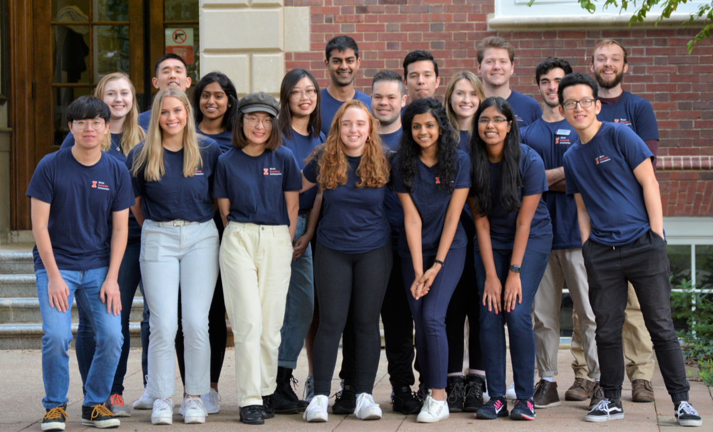
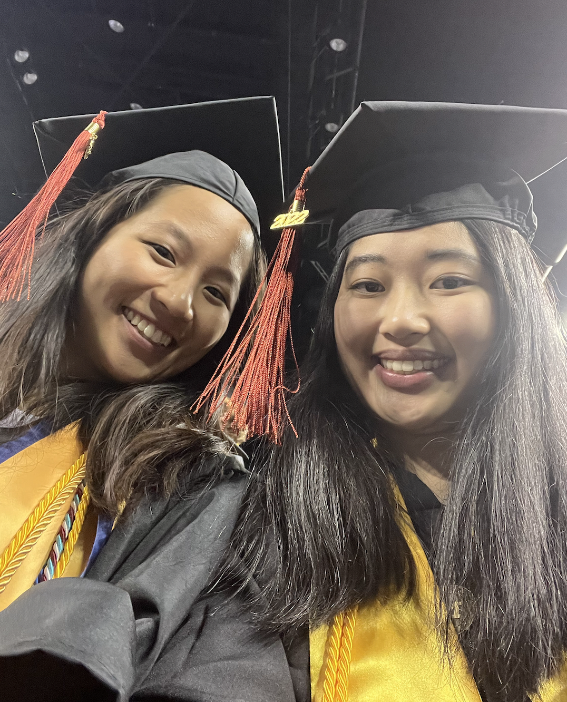

# About Us

In this section you can get to know more about the members of Coded in COBOL.

## Yuchen Gao

Hello! My name is Yuchen Gao. I'm currently a master student pursuing a [MBAn](https://michiganross.umich.edu/graduate/master-of-business-analytics) degree from the Ross School of Business at the University of Michigan. I have an undergraduate degree in Information Science from the [School of Information](https://www.si.umich.edu/) at the University of Michigan.

I am passionate about transforming data into impactful business solutions and would hope to work in the analytics field after getting my master's degree.

{width=50%}

**My favorite quote**
> “All models are wrong, but some are useful”       
>  George E.P. Box

**Interests and Hobbies**
- I spent the first 18 years of my life in Shanghai, but I also lived in Boston for two years before coming to Ann Arbor, MI.
- In my free time I like to play tennis. I'm currently trying to improve my backhand and serving.
- I'm a big fan of electronic music. My most favorite genres are techno house, future house, future bass.
- My favorite novel is Neuromancer by William Gibson. 
- I'm a coffee enthusiast. My favorite kind of coffee bean is Panama Geisha. If you happen to go to any coffee shop that is offering Geisha I highly recommend you to try it.

**More about Me...**
You can find more information about my professional experiences on [LinkedIn](https://www.linkedin.com/in/ycg2022/) and check out my past coding projects on [Github](https://github.com/Yuchen-G).

## Nikita Mamidi

**I'm Nikita Mamidi 😃**

------------------------------------------------------------------------

{width="900" height="450"}

**A little bit about me:**

I graduated from the University of Illinois at Urbana Champaign with a BS in Econometrics and Quantitative Economics. I look back fondly on my undergrad days where I was an Ambassador for the amazing Economics department, the Head Teaching Assistant for a Business Statistics Course and a Senior Associate at Illinois Business Consulting. **GO ILLINI!**

In today's world organizations are coming up with so many fascinating data and tech driven solutions to previously insurmountable problems. I want to be part of such a force that impacts the world positively. To achieve those high-level data science skills, I recently started my Masters of Business Analytics at the Ross School of Business!

</style>

{width="450" height="350"} {width="450" height="350"}

------------------------------------------------------------------------

**Recent Work Experience:**

MSN Pharmaceuticals :- Sales and Marketing Executive

-   Responsible for the South Korean, Japanese, Indonesian, Thailand and Taiwanese markets
-   Determined potential partnerships in East Asia, established contacts & built relationships with key decision makers
-   Collaborated with technical teams to ensure production and distribution of high-quality samples and final API
-   Achieved the **\$3 million per month** revenue target for the past 2 quarters

------------------------------------------------------------------------

**Fun Facts:**

{width="320" height="350"} {width="500" height="350"}

 

-   I love to travel. Been to 20 countries. Next Destination - Mexico 🇲🇽
-   Stock market trading is everything! I'm a day trader tho, I know I'm awful 🤭
-   Certified online shopaholic. But I also return the goods with equal speed
-   I love watching (and dreaming of playing) in the NBA
-   I enjoy snorkeling and scuba diving
-   I'm terrified of all animals. Yes, including cute puppies and kittens 🤯

**That's enough about me 😁. Please reach out so I can learn more about You!**

<u> [Linkedin](https://www.linkedin.com/in/nikita-mamidi-763b80185/)</u>

<u> Contact - 217-898-6828 </u>

## Ben Newman
> Team: Coded in COBOL

Bio: Hi, I'm Ben. I was raised in Midland, MI. It's in the middle-right part of the mitten. In high school, I was on the swim team (see below) and did cross country. I also attended University of Michigan from which I graduated last year (see below). Some things that bring joy to my life are friends, family, my pets (see below), skiing, fishing, and going to Michigan Football Games!!

**My Education**

- Saint Brigid Catholic School (Midland, MI USA)
- Herbert Henry Dow High School (Midland, MI USA)
- University of Michigan Ann Arbor (Ann Arbor, MI USA)
    - B.S. Statistics
- University of Michigan Ann Arbor (Ann Arbor, MI USA)
    - Masters in Business Analytics

**My favorite foods.**

1. Pizza
2. Orange Chicken
3. Burgers

{width=25%}

> A picture of me (left) in my more fit days on the swim team (circa 2017).

{width=25%}

> A picture of my dogs Pearl (left) and Blue (right). They are Weimaraners.

{width=25%}

> This is me at the University of Michigan Commencement with my family in April, 2022.

## Peiyue Sun
This is Peiyue Sun.

- I love Michigan Wolverines!
- I love Wisconsin Badgers!

Education:

- Wisconsin School of Business 2016 -> 2019 Risk Management & Insurance (BBA)
- Ross School of Business 2022 -> 2023 Business Analytics (MBAn)

Technology used:

- R
- Python
- Excel

Work Experience:

- 2 years at Willis Towers Watson risk consulting sector
  * Insurance-linked securities valuation
  * Financial Reserving for global insurance enterprises
  
Goal at MBAN:

- Unlock my potential in business analytics and project management

Hobbies:

- Snooker, Basketball, Texas Hold'em, Swimming, Running, Biking, and Trap music festivals

{width=256}

## Winnifer Chen

Winnifer Chen

Email: winnifer@umich.edu

Phone: (980) 298-7184

LinkedIn: https://www.linkedin.com/in/winnifer/ 

**Educational Background**
I recently graduated with a Bachelor of Science in Economics with a minor in Statistics from the University of Michigan in April 2022. Currently, I am pursuing a Master of Business Analytics at the University of Michigan - Stephen M. Ross School of Business, with an expected graduation date of April 2023. 

{width=25%}
{width=40%}
{width=25%}

**Fun Facts!**
- I am from Ann Arbor, MI, but throughout my life, I have also lived in Charlotte, NC and Taipei, Taiwan.
- I come from a family of Wolverines! Both of my parents also attended graduate school at Michigan, and my younger sister is starting her freshman year this fall. GO BLUE!
- In my free time, I love to spend time outdoors, whether that is hiking, camping, or taking pictures of scenery. Check out some of the pictures I took: https://vsco.co/winniferchen/gallery
- I really enjoy rewatching music videos and performances by my favorite kpop groups. One of my dreams is to go to a kpop concert one day and sit in the very front section. 
- Immersing myself in the world of kdramas is another way for me to wind down and relax after a long day. 
- Something that I want to do more this year is trying new recipes and cooking more. 

{width=23%}
{width=25%}
{width=25%}
{width=25%}

## Jalal Mawri

Current Master of Business Analytics student at the Ross School of Business

{width=25%}
{width=25%}
{width=25%}

**Background**

I was born and raised in Yemen, the old city of Sana'a, and I left the country in 2013 with my family and immigrated to the United States. I grew up playing Football, a.k.a soccer, and my favorite team was and still is Manchester United.

**Education**

- I graduated from the University of Michigan with High Honors in Biology and International Studies.
- During my first two years as an undergraduate student I had the opportunity to work on a research project at the Medical School where we researched preventive medical treatments for strokes.
- During my senior year I wrote my thesis on the current civil war in Yemen, and I researched the Islamic Movement of Ansar Allah which is currently leading the political scene in Yemen and the Arabian Peninsula.

**Professional Experience**

- After graduating I interned for the Muslim Public Affairs Council, and worked on a project that persuaded the Biden Administration to enforce the reopening of Sana's Airport and push for a peace resolution between the parties involved in the war.
- After my internship, I started to work as a Data Analyst for Amazon.
- My plan after I graduate from Ross is to go back to Amazon and work as Business Intelligence Engineer.

**Publications**

Mawri, Jalal. “Ansar Allah in Yemen: History and Ideology.” Deep Blue Repositories, 1 Aug. 2021, https://deepblue.lib.umich.edu/handle/2027.42/169403.

Venugopal J, Wang J, Mawri J, Guo C, Eitzman D. Interleukin-1 receptor inhibition reduces stroke size in a murine model of sickle cell disease. Haematologica. 2021 Sep 1;106(9):2469-2477. doi: 10.3324/haematol.2020.252395. PMID: 32817286; PMCID: PMC8409048.