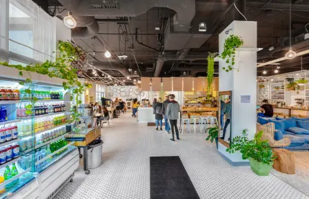
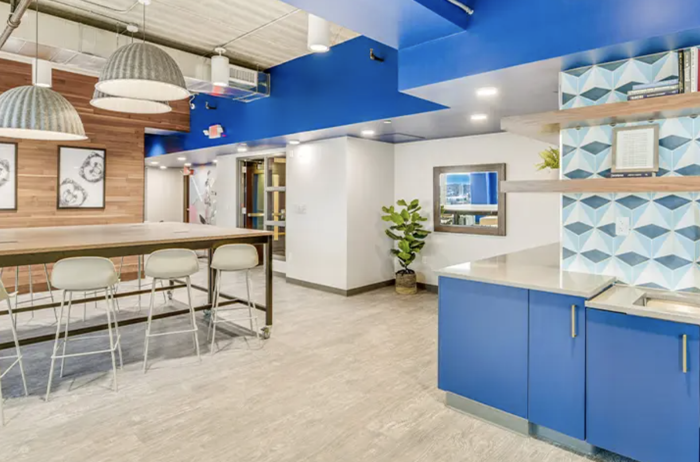
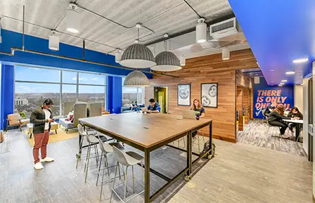
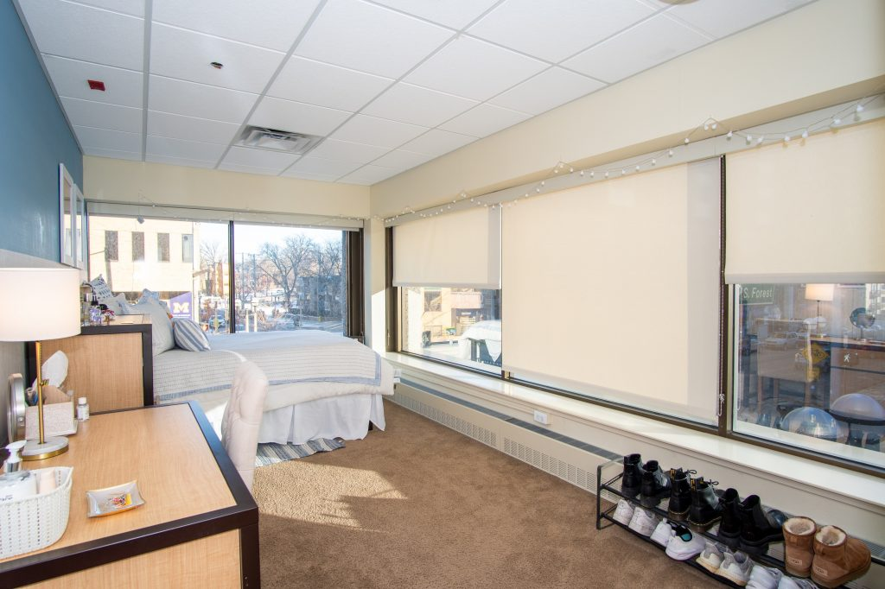
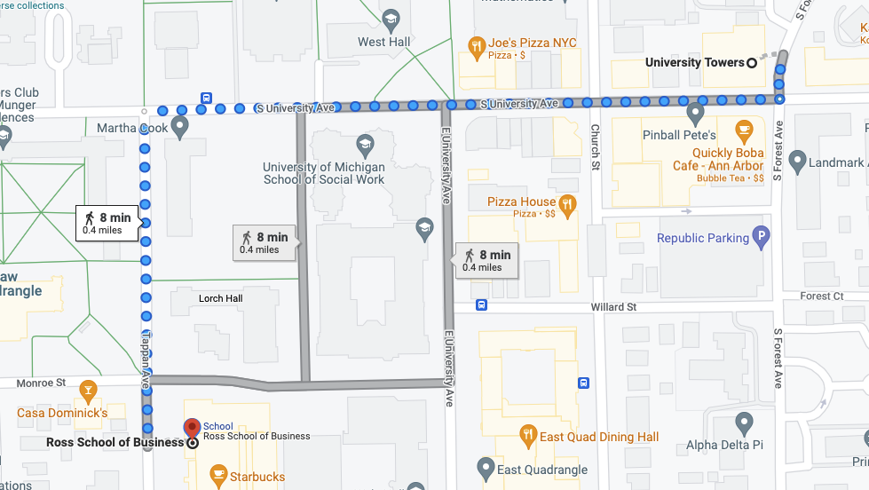
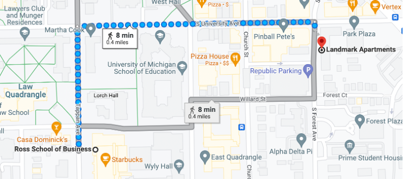
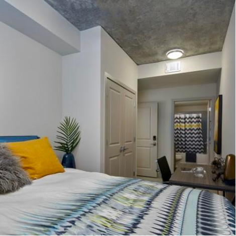
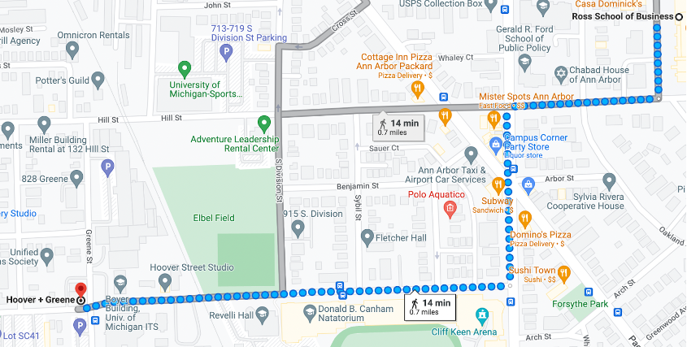
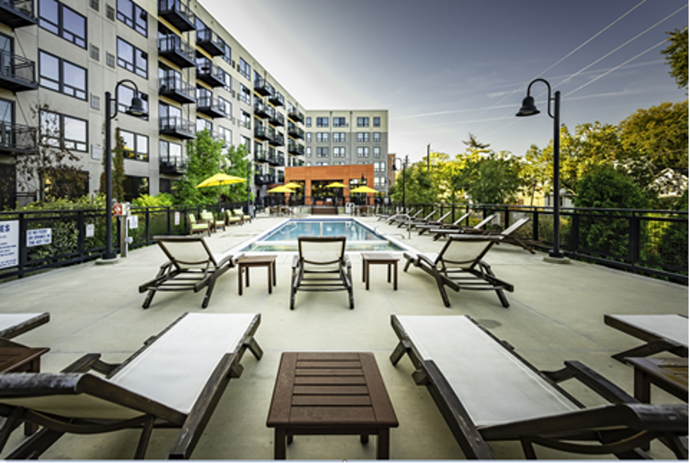

# Housing

## Finding a sublease
<style>
title {
  color: #3D0C02;
  font-family: Comic Sans MS;
  }
  
body {
  color: #3D0C02;
  font-family: Verdana;
  }

</style>

<br>
**Facebook groups -**
You can use these groups to find subleases to your liking. The posts usually specify the number of beds/baths, amenities, prices, pictures and contact info. Make sure to reach out to the subleaser through messenger. You can always negotiate and reduce the price as it is a buyers market in Ann Arbor.

<br>
{width="300" height="250"} 
{width="300" height="250"}
{width="300" height="250"} 


- UMICH Housing, Rooms, Apartments, Sublets - (largest group with 33.4 K members)
https://www.facebook.com/groups/223351171575348/
- UMich Campus Housing (OFFICIAL)
<br>
https://www.facebook.com/groups/551056069413485/
- Ann Arbor Roommates and Housing
<br>
https://www.facebook.com/groups/267575123414633/

<br>
**Pro Tips** - Have a video call with the subleaser and see the apartment for yourself if you are unable to visit, read google reviews and talk to current students to get a better idea of the apartment(location, management, maintenance) 

<br>
**Calling Apartments: **
Another method that works would be to call the different apartments in areas you are interested in and ask them if any residents are interested in subleasing. They will connect you with subleasers or add you to their addressbook so they can reach out anytime any sublease becomes available. 

You could also ask for a lease transfer though this is a more expensive option as you need to pay the entire rent for the month. Lease transfers/takeovers are more useful if you want the lease for the entire academic year. 

<br>
**WeChat - **
UM信息平台
<br>
Wechat number: UMhome
<br>
You can use this user id from WeChat to find available sublets by accessing the moments page. 


## Lease Subletting Information

### Who this page is for:
- Current MBAn students wishing to sublet their current leases to future MBAn studets
- Prospective and admitted MBAn students wanting to find housing for the former or latter part of their experience

### You Want to Sublet Your Lease
So, you want to sublet your lease, but have had trouble finding someone. Great! We have taken the pain out of this process by connecting you with future MBAn students hungry to find a place to stay for a few months before their lease starts. To get started, just fill out this form. Interested students will be able to see all of this information and will contact you if they are interested. 

Form: https://docs.google.com/forms/d/e/1FAIpQLSfd5a1n3rtsh2xlqPA1M3tiaQFIl-nXuANBcQ9awZvN5U2sag/viewform

### You Need a Place to Stay
Your lease doesn't start until August, so you need a place to stay for the summer. Or, your lease ends early and you need a place to stay for those last few month of the MBAn program. No problem! In the Google Sheet below, you will find a list of current MBAn students wishing to sublet their lease. Plenty of information about the properties is included in this document, but if you need more info, don't hesitate to reach out--contact information is provided. Happy shopping!

Sheet: https://docs.google.com/spreadsheets/d/1nCS9Tw-RBSAceeZNXqH_YfsoTt1rkVl-x5Z3lqS9AoQ/edit?resourcekey#gid=536291696


## Dorms
Graduate Residence Options for incoming MBAn students

Option 1: Munger Graduate Residence

Address: 540 Thompson St, Ann Arbor, MI 48104

Phone: 734-764-0145

E-mail: msaraino@umich.edu

Price: $1100/Month -> $2000/Month

Description: 
Located on Central Campus, the Munger Graduate Residences are designed specifically for graduate and professional level students from all U-M schools and colleges to actively engage in a transdisciplinary community. Transdisciplinary living brings a diverse mix of graduate and professional students from various fields together to live, study and build a culture of collaboration. You’ll join other graduate students in a furnished apartment with 6 or 7 single-occupancy bedroom suites, each with a private bathroom. The suites also include a very large kitchen, dining room and community space.


{width=256}


{width=256}

Option 2: EAST QUADRANGLE

Address:701 East University Avenue, Ann Arbor, MI 48109-1245

Phone: 734-764-0100

E-mail: msaraino@umich.edu

Price: $1100/Month -> $2000/Month

Description: 
East Quad, a mixed-gender, undergraduate residence hall, is home to approximately 850 students each year. It’s on Central Campus near the South University shopping area and many academic buildings including Ross School of Business and the School of Education.


{width=256}


{width=256}

## High-rise Apartments

### Central Campus
#### Foundry Lofts

{width=32%}
{width=32%}
{width=31%} 
```{r, echo=FALSE, fig.align='center'}
knitr::include_graphics("Foundry map.PNG")
```

**Website:** https://www.foundryloftsannarbor.com/?utm_medium=market_site&utm_campaign=market_site&utm_source=liveumich

**Floor plans:**
Studio, 1-, 2-, 3-, & 4-Bedroom Apartments

**Description:**
If you’re looking for a lavish living experience with exclusive amenities, a premier location just minutes from campus, and the latest in interior apartment features, Foundry Lofts is right for you. Enjoy scenic views from the rooftop deck, stay productive in the work and study lounge, or satisfy late-night cravings at our ground-floor retail area. With fully furnished floor plans featuring private bedrooms and bath suites, expansive closets, stainless steel appliances, and so much more, Foundry Lofts offers everything one needs to live in style and comfort. With the needs of young professionals in mind, Foundry Lofts seamlessly weaves features to promote academics and socialization with a community that feels like home.

**Pros:**
Near Local Restaurants & Retail in Downtown

#### Saga Ann Arbor

{width=32%}
{width=32%}
{width=31%} 
```{r, echo=FALSE, fig.align='center'}
knitr::include_graphics("saga map.jpg")
```

**Website:** 
https://www.sagaannarbor.com/

**Floor plans:**
1-, 2-, 3-, & 4-Bedroom Apartments

**Description:**
Saga Ann Arbor provides students with more than just a place to call home. The off campus housing near University of Michigan is centrally located in Ann Arbor, just minutes from the campus and many local favorites, including restaurants, shopping outlets, and recreation. But residents don’t have to go far for fun and relaxation, as our community boasts an array of resort-style amenities that help strike the perfect work-life balance. In addition, the apartments come fully furnished and boast modern interior features. For a UMich living experience unlike any other, look no further than Saga Ann Arbor.

**Pros:**
Nearby Retail & Shopping Destinations

### Apartments Near Ross

#### University Towers 

{width=32%} 
{width=32%} 
{width=25%} 
```{r, echo=FALSE, fig.align='center'} 
 
```

**Website:** 
https://u-towers.com/

**Floor plans:**
1-, 2-, 3-, & 4-Bedroom Apartments

**Description:**
Majestically overlooking downtown Ann Arbor, University Towers is the new standard for students in downtown apartment living. University Towers student housing features spacious and contemporary studio, one, two, and three bedroom floor plans with resort-class amenities and an award-winning leasing and maintenance staff. Residents can choose between two custom finish packages, and each apartment home is equipped with a fully renovated kitchen and bathroom, spacious bedrooms, and brand new windows with breathtaking views of the city.
Venturing outside of their off campus housing, residents indulge in various community amenities including the outdoor resort-style swimming pool, 24/7 state of the art fitness center, free Vertex coffee and tea bar, on-site restaurant, and convenience store.

**Pros:**
Over 30 restaurants and coffee shops are within 2 blocks from the apartment including East Quad dining.


#### Landmark

{width=32%}
{width=30%}
{width=35%}
```{r, echo=FALSE, fig.align='center'}

```


**Website:** https://www.livethelandmark.com/ 

**Floor plans:** Studio, 2-, 3-, 4-, 5-, & 6-Bedroom Apartments

**Description:** Landmark is a high-rise luxury apartment located just in an 8-minute walk away from Ross. They offer a variety of floor plans from 1 to 6 bedrooms that come with 1 to 4 baths. In terms of pricing, the monthly rent ranges from $1250 to $2074. 


**Pros:** Washer and dryer in unit, fully furnished, and amenities include gym, pool, hot tub, study space, garage parking, theater


#### z place 

{width=36%}
{width=32%}
{width=30%}
```{r, echo=FALSE, fig.align='center'}
knitr::include_graphics("zplace_map.png")
```


**Website:** https://www.zplaceapartments.com/


**Floor plans:** 2-, 4-, & 6-Bedroom Apartments


**Description:** Located just a 4 minute walk away from the Ross School of Business, Z Place Apartments offers luxury apartment units that will give you feel a sense of home, even when you are away from home. 


**Pros:** Washer and dryer in unit, fully furnished, and amenities include gym, underground parking


#### Six11

{width=33%}
{width=32%}
{width=33%}
```{r, echo=FALSE, fig.align='center'}
knitr::include_graphics("611_map.png")
```


**Website:** https://www.livesix11.com/


**Floor plans:** Studio, 4-, 5-, & 6-Bedroom Apartments


**Description:** Looking for a luxury apartment just 5 minutes away from Ross? Six11 offers apartment units ranging from $1489 to $2359. 


**Pros:** Washer and dryer in unit, fully furnished, and amenities include rooftop terrace, gym, printers, study rooms, parking garage


### South Campus
#### Hoover and Greene

{width=32%}
{width=32%}
{width=32%}
```{r, echo=FALSE, fig.align='center'}

```


**Website:** https://hooverandgreene.com/


**Floor plans:** Studio, 1-, & 2-Bedroom Apartments


**Description:** Hoover and Greene is a luxury apartment complex located on the South side of campus, with close proximity to many of the athletic fields, and most importantly the Big House. Perfect location for any sports fans, as well as anyone studying at Ross. 


**Pros:** Washer and dryer in unit and amenities include gym, working space, courtyard terrace, pool


#### 618 South Main


{width=32%}
{width=32%}
{width=32%}
```{r, echo=FALSE, fig.align='center'}
knitr::include_graphics("SM_map.png")
```


**Website:** https://www.618southmain.com/


**Floor plans:** Studio, 1-, & 2-Bedroom Apartments


**Description:** 618 South Main is another housing option for anyone interested in living on South Campus near the athletic fields. In addition, this is one of the few high-rise, luxury apartments near campus that allows pets. 


**Pros:** Washer and dryer in unit, and amenities include gym, resident lounge, pool and hot tub, and underground parking. 2 pets are allowed but you do have to pay both a one-time fee and monthly rent. 


