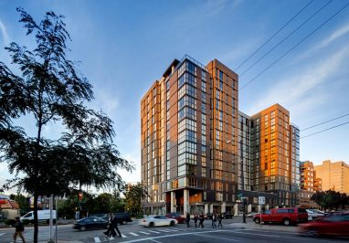
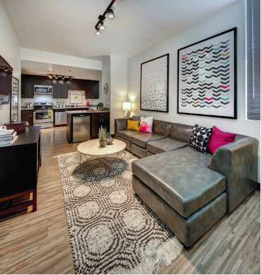
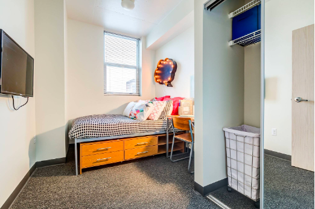
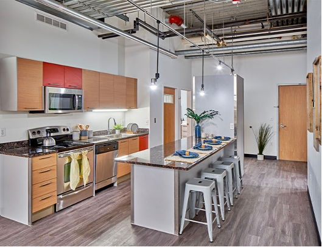
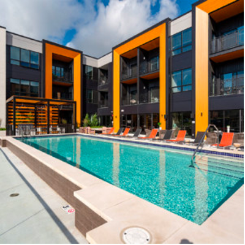
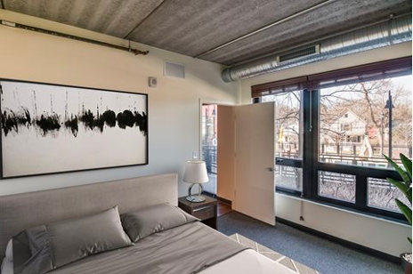

# Housing

## Finding a sublease

## Sublease Information Google Sheet

## Dorms

## High-rise Apartments

### Central Campus

### Apartments Near Ross
* Foundry Lofts

{width=25%}
{width=25%}
{width=24%} {width=24%}

**Website:** https://www.foundryloftsannarbor.com/?utm_medium=market_site&utm_campaign=market_site&utm_source=liveumich

**Floor plans:**
Studio, 1-, 2-, 3-, & 4-Bedroom Apartments

**Description:**
If you’re looking for a lavish living experience with exclusive amenities, a premier location just minutes from campus, and the latest in interior apartment features, Foundry Lofts is right for you. Enjoy scenic views from the rooftop deck, stay productive in the work and study lounge, or satisfy late-night cravings at our ground-floor retail area. With fully furnished floor plans featuring private bedrooms and bath suites, expansive closets, stainless steel appliances, and so much more, Foundry Lofts offers everything one needs to live in style and comfort. With the needs of young professionals in mind, Foundry Lofts seamlessly weaves features to promote academics and socialization with a community that feels like home.

**Pros:**
Near Local Restaurants & Retail in Downtown

* Landmark

{width=23%}
{width=15%}
{width=25%}
{width=35%}

**Website:** https://www.livethelandmark.com/ 

**Floor plans:** Studio, 2-, 3-, 4-, 5-, & 6-Bedroom Apartments

**Description:** Landmark is a high-rise luxury apartment located just in an 8-minute walk away from Ross. They offer a variety of floor plans from 1 to 6 bedrooms that come with 1 to 4 baths. In terms of pricing, the monthly rent ranges from $1250 to $2074. 

**Pros:** Washer and dryer in unit, fully furnished, and amenities include gym, pool, hot tub, study space, garage parking, theater

* z place 

{width=24%}
{width=20%}
{width=18%}
{width=36%}

**Website:** https://www.zplaceapartments.com/

**Floor plans:** 2-, 4-, & 6-Bedroom Apartments

**Description:** Located just a 4 minute walk away from the Ross School of Business, Z Place Apartments offers luxury apartment units that will give you feel a sense of home, even when you are away from home. 

**Pros:** Washer and dryer in unit, fully furnished, and amenities include gym, underground parking

* Six11

{width=22%}
{width=22%}
{width=22%}
{width=28%}

**Website:** https://www.livesix11.com/

**Floor plans:** Studio, 4-, 5-, & 6-Bedroom Apartments

**Description:** Looking for a luxury apartment just 5 minutes away from Ross? Six11 offers apartment units ranging from $1489 to $2359. 

**Pros:** Washer and dryer in unit, fully furnished, and amenities include rooftop terrace, gym, printers, study rooms, parking garage

### South Campus
* Hoover and Greene

{width=20%}
{width=20%}
{width=20%}
{width=36%}

**Website:** https://hooverandgreene.com/

**Floor plans:** Studio, 1-, & 2-Bedroom Apartments

**Description:** Hoover and Greene is a luxury apartment complex located on the South side of campus, with close proximity to many of the athletic fields, and most importantly the Big House. Perfect location for any sports fans, as well as anyone studying at Ross. 

**Pros:** Washer and dryer in unit and amenities include gym, working space, courtyard terrace, pool

* 618 South Main

{width=20%}
{width=20%}
{width=20%}
{width=36%}

**Website:** https://www.618southmain.com/

**Floor plans:** Studio, 1-, & 2-Bedroom Apartments

**Description:** 618 South Main is another housing option for anyone interested in living on South Campus near the athletic fields. In addition, this is one of the few high-rise, luxury apartments near campus that allows pets. 

**Pros:** Washer and dryer in unit, and amenities include gym, resident lounge, pool and hot tub, and underground parking. 2 pets are allowed but you do have to pay both a one-time fee and monthly rent. 

