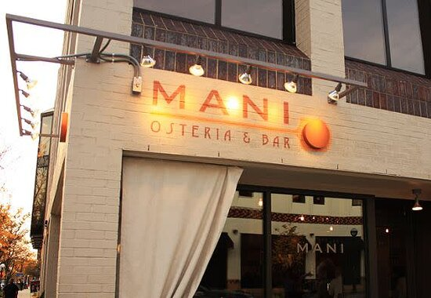

# Best Restaurants and Bars

## Restaurants

**Sava's**

Sava's is a modern, upscale eatery serving mostly American dishes. They have many great mac and cheese varieties, a nice bar, and the interior was recently renovated in 2021. It is a bit on the pricey side, so it a great place to take the parents (;

Menu is available here: https://www.savasannarbor.com/menu

{width=256}

**Frita Batidos**

Frita Batidos serves delicious Cuban street food. The restaurant's name is inspired by two staples in the world of Cuban street food: the "frita," which is a burger traditionally made from spicy chorizo served with shoestring fries on top in a soft egg bun and the "batido," which is a tropical milkshake made with fresh fruit, crushed ice, and sweetened milk.

Menu is available here: https://fritabatidos.com/ann-arbor/menu-guide/

{width=256}

**Mani Osteria**

Mani-Osteria is an italian restaurant serving wood-oven pizza & specialty small plates plus a bar with old-world wines & local beer. It was also voted "most romantic in Ann Arbor." They have outdoor seating here as well.

Menu is available here: https://maniosteria.com/

{width=256}

**Tomukun Korean Barbecue and Noodle Bar**

My personal favorite, this combination barbecue-noodle bar offers a great combination of traditional Korean dishes and inventive culinary creations. The barbecue offers guests the chance to cook meat variety platters on personal tabletop grills. The noodle bar is always packed, but great for affordable and delicious take-out.

Menus are available here:

- Noodle Bar: http://noodlebar.tomukun.com/menus/tnb_menu.pdf
- Barbecue: http://bbq.tomukun.com/menus/tkb_menu.pdf

{width=256}

**Totoro**

Totoro is a small, bright Japanese restaurant offering a wide range of classic, contemporary, and regional dishes. A hidden gem, the restaurant offers amazing sushi and udon. The name is based off the 1989 animated film "My Neighbor Totoro."

Menu is available here: https://totoroannarbor.com/menus

{width=256}

**The Gandy Dancer**

Situated in the beautifully restored 1886 Michigan Central Depot, Gandy Dancer is both an architectural landmark and an elegant restaurant. A popular venue in Ann Arbor, the Gandy Dancer's fine cuisine and historic atmosphere make a grand setting for rehearsal dinners and wedding receptions. Come see why diners all over Michigan choose us time and time again.

Menu is available here: https://www.gandydancerrestaurant.com/menus/

{width=256}

**Vedge Cafe**

Vedge Cafe serves a great variety of vegan, vegetarian and gluten-free foods which you can work in to your busy schedule. They also offer both take-out and delivery.

Menu is available here: https://www.vedgecafea2.com/menu

{width=256}

## Bars

**Bill's Beer Garden**

Bill's Beer Garden has a great selection of draft beers, is kid and pet friendly, and has an awesome outdoor seating area with picnic tables where you can bring large groups.

Menu is available here: https://www.billsbeergarden.com/drink-menu

{width=256}

**The Grotto**

The Grotto features 36 constantly-rotating craft beer taps from over the US and around the world, and world-class wines. They also have a decently sized outdoor seating area. Once you're tipsy, you can visit Fleetwood across the street for some hippie hash (:

Menu is available here: https://thegrottobar.com/

{width=256}

**The Brown Jug**

Located just one block away from Ross, the Brown Jug is a classic American bar where you can come and hang out with friends. They have lots of good specials here, such as $10 for a bucket of 5 Blue Moons. Its namesake comes from the Michigan vs Minnesota football trophy, which is the oldest in college football.

Menu is available here: https://brownjug-annarbor.com/menu/

{width=256}

**Garage Bar**

Garage Bar is a relatively new bar to Ann Arbor, but they offer a great covered outdoor seating area perfect for late summer and fall. Garage Bar is located only two blocks from Ross, making it the perfect way to cap off a busy week and unwind.

Menu is available here: https://brownjug-annarbor.com/menu/

{width=256}
