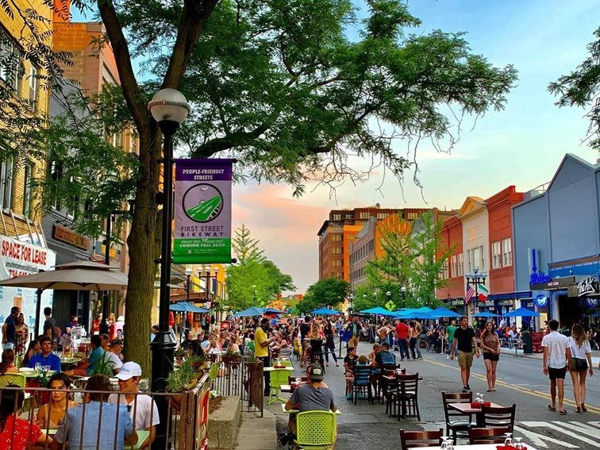

# Fun Things to do in Ann Arbor

## Outdoor Activities

- Many students like to relax, read, have picnics, and go hammocking at the Law Quad or Diag, both of which are within a 5-minute walk from Ross. 

{width=50%}
{width=45%}


- Palmer Field, located on the hill area near the Central Campus Recreational Building (CCRB), is another option for engaging in sports outside of class. Right beside Palmer Field, there are tennis courts, basketball courts, and an outdoor track. 

```{r, echo=FALSE, fig.align='center'}

```

- Elbel Field is another option for sports. Located on South Campus near the Stadium, this is where intramural beach volleyball, one of the activities that the inaugural class of the MBAn program participated in, takes place. Frisbee and soccer are also often played on Elbel Field. During the school year, the Michigan Marching Band holds practices here. 

```{r, echo=FALSE, fig.align='center'}
knitr::include_graphics("elbel.jpeg")
```


- The Arboretum is a great place for those who enjoy hiking, and there are many biking and jogging trails that go through the Arb. 

{width=45%}
{width=54%}

- Every summer, there is an [Art Fair](https://www.theannarborartfair.com/) in July where many vendors will come and set up tents on the streets of downtown Ann Arbor and sell their artwork or other artistic items. This is a great way to learn about all the unique designs and objects people hand make. 

```{r, echo=FALSE, fig.align='center'}
knitr::include_graphics("artfair.png")
```


- During the month of July, there is also a [carnival](https://a2jaycees.org/carnival) at Pioneer High School, located just across the street from the Michigan Stadium. Even as a graduate student, booths with fair games and food, a Ferris wheel, and other amusement park rides will be hard to resist on a hot summer day!

```{r, echo=FALSE, fig.align='center'}
knitr::include_graphics("carnival.webp")
```


- Off-campus, there are a lot of parks nearby that are perfect for canoeing, kayaking, fishing, tanning, and outdoor barbeques. Gallup Park and Bandemer Park are among the most popular that many MBAn students visit on the weekends. 

{width=36%}
{width=25%}
{width=32%}


## Shopping
The summer is also the perfect time to purchase any winter apparel that will help you get through Michigan winters. Although the following places are located at least a 30-minute drive from Ann Arbor, it is a good idea to visit them during the summer, for example during the one-week break between the summer and fall semesters, to make sure that you are as well-prepared as possible for the colder months. 

- [Briarwood Mall](https://www.simon.com/mall/briarwood-mall) is a 10-minute drive from Ross, and it is a great place for a quick weekend shopping trip. 

- [Twelve Oaks Mall](https://shoptwelveoaks.com/) is located in Novi, approximately a 30-minute drive from Ann Arbor. 

- [Somerset](https://www.thesomersetcollection.com/) is the largest mall near Ann Arbor. It has both a regular side and a high-end side. It is located in Troy, which is about an hour’s drive from Ann Arbor. 

- [Great Lakes Crossing](https://greatlakescrossingoutlets.com/) is an outdoor outlet that offers discounted deals on winter apparel and gear. It is in Auburn Hills, which is also about an hour’s drive from Ann Arbor. 

- [Birchrun Outlet](https://www.premiumoutlets.com/outlet/birch-run) is another option for finding affordable winter clothes and boots. Located in Birch Run, this outlet is also about an hour’s drive from Ann Arbor. 


## Downtown Ann Arbor
- Downtown Ann Arbor is home to many of the most Instagrammable spots in Ann Arbor, not only is there a graffi alley and  murals, there are also many fancy restaurants to take any foodie’s content to the next level. 

{width=30%}
{width=36%}
{width=30%}


- One cannot talk about downtown Ann Arbor without mentioning Kerrytown, where the Farmers’ Market is held every Wednesday and Saturday morning.  

{width=47%}
{width=47%}
 

- Besides shopping for fresh produce and trying out different restaurants in downtown Ann Arbor, you can also visit Rocket Fizz for unique candy and soda flavors, buy a manga or two at the Vault of Midnight, sample chocolate–covered cherries at Cherry Republic, borrow books from the Ann Arbor Downtown Library, or try on cute outfits at local boutiques. 

{width=50%}
{width=45%}
 


## Things to Do 
### Movies
- State Theater

- Michigan Theater

- Cinemax

### Museums
- UMMA

- Natural History

- Kelsey Archaeology 

### Miscellaneous
- Karaoke

- Ax-throwing 

- Go-karting 

- Bowling 


## Athletic Events
A huge part of the Michigan school spirit comes from athletic events, namely football, basketball, and hockey games. You can purchase season tickets () to these three sports prior to the start of the fall semester. In the winter, Yost Ice Arena has open-skate hours when you and your friends can rent ice skates and take a break from studying. 

## Places to Visit Outside Ann Arbor
### Southeast Michigan 
- Detroit - Belle Isle, Riverfront, Detroit Zoo, Mom’s Spaghetti (Eminem), Gus’s Fried Chicken 

- Dearborn - Henry Ford Museum  

- Troy - Round1, Somerset, HMart, Bowling 

- Novi/Northville - Lucky Strike bowling, escape room, Twelve Oaks, maybury park

### West Michigan
- Lake Michigan (Silver Beach, Grand Haven)

- Traverse City

- Grand Rapids 

- Holland

- Kalamazoo 

### Upper Peninsula
- Mackinac Island 
