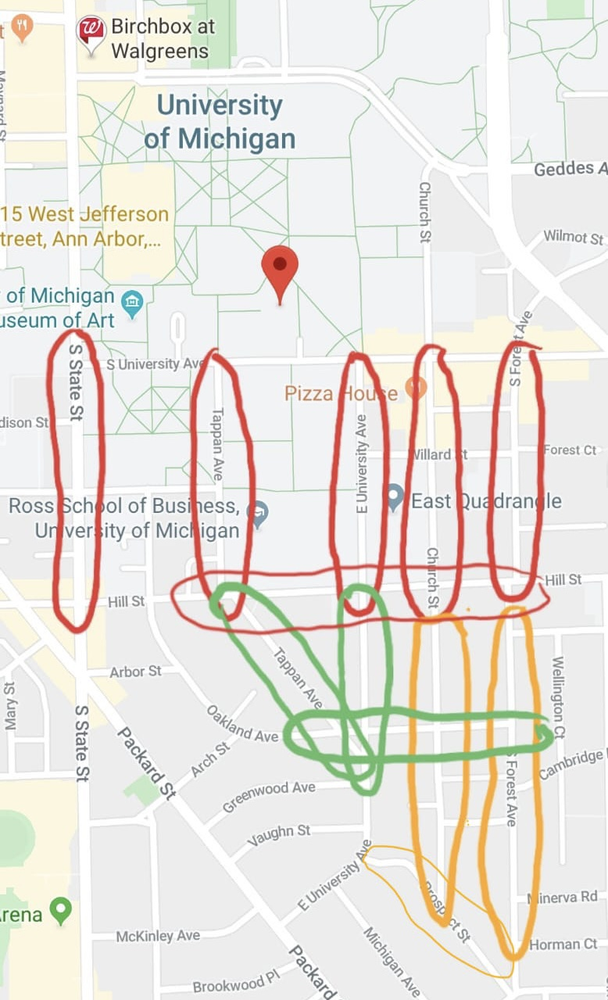

#Parking 🚗

Finding a parking spot in Central Campus is a very hard challenge for most people, but we have made it so much easier for you. Just copy and paste the coordinates provided for each street to your preferred phone GPS application and good luck on finding a spot near the building you're going to.  

## Before parking your car, here are some things to keep in mind:

1. **DO NOT** park your car in front of fire hydrants. These are used by the fire emergency trucks when responding to an emergency in the area. You might get a ticket or get your car towed if your car was found near one of them.


2. **DO NOT** block driveways when parking your car. This could also result in your car getting towed or you receive a ticket.


3. **ALWAYS PAY ATTENTION TO STOP SIGNS.**


4. **Important**: The earlier you arrive to campus, the easier it's to find a spot quickly. 

## Streets where You Can Park your Car for Free all day (Green)
**Tappen Ave** (Starting at the intersection with Hill St all the way until Oakland Ave)

Coordinates: 42.27188° N, 83.73788° W

**E. University Ave** (Starting at the intersection with Hill St all the way until Packard St)

Coordinates: 42.27192° N, 83.73569° W

**Oakland Ave** (Starting at the intersection with Hill St all the way until Forest Ave)

Coordinates: 42.27182° N, 83.73941° W


## Streets where You Can Park your Car for Free for Four Hours (Orange)
**Church St** (Starting at the intersection with Hill St all the way until Prospect St)

Coordinates: 42.27194° N, 83.73449° W

**S. Forest Ave** (Starting at the intersection with Hill St all the way until Prospect St)

Coordinates: 42.27194° N, 83.73449° W

**Prospect St** (Starting at the intersection with Wells St all the way intil E. University Ave)

Coordinates: 42.26701° N, 83.73328° W


## Streets where You Can Park your Car with Parking Meteres (Red)
These streets have meters on them where parking is available for $1.60 /hour (no permit is required)
**Tappen Ave** (Starting from the intersection with S. University Ave all the way until Hill St)

Coordinates: 42.27488° N, 83.73825° W

**E. University Ave** (Starting at the intersection with S University Ave all the way until Hill St)

Coordinates: 42.27492° N, 83.73457° W

**Church St** (Starting at the intersection with S. University Ave all the way until Hill St)

Coordinates: 42.27492° N, 83.73457° W

**S. Forrest Ave** (Starting at the intersection with S. University Ave All the way until Hill St)

Coordinates: 42.27493° N, 83.73313° W

```{r, echo=FALSE, fig.align='center'}

```


