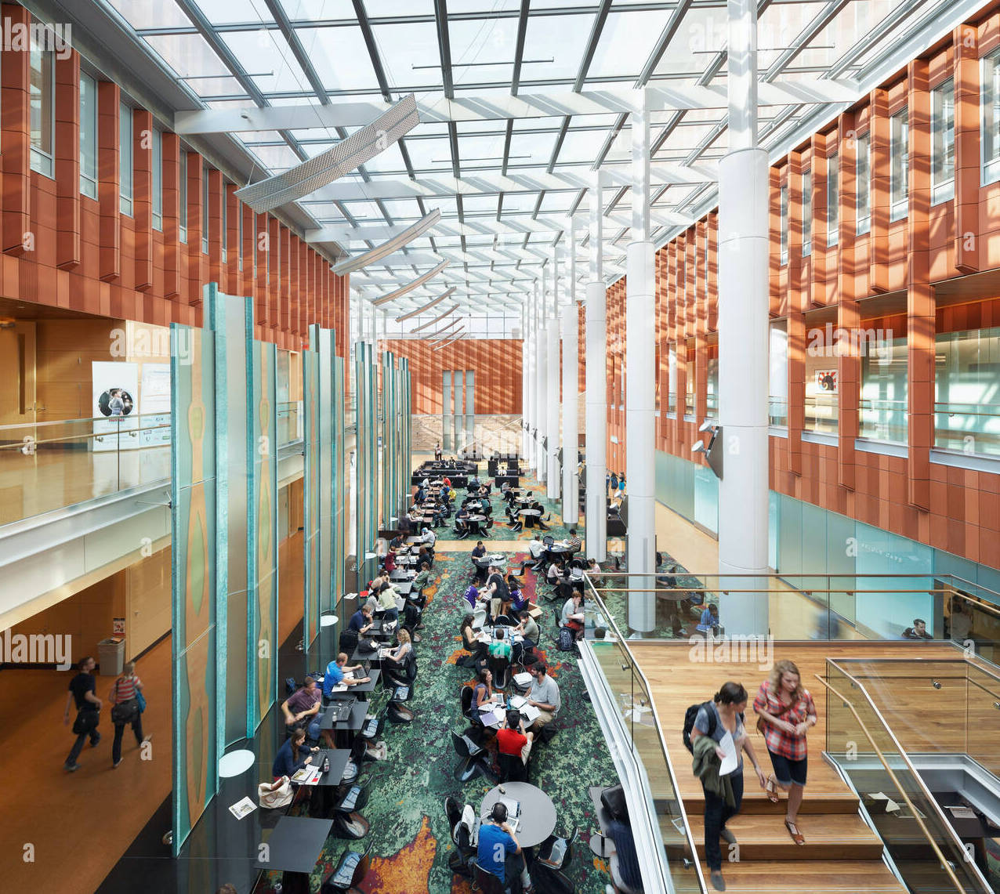
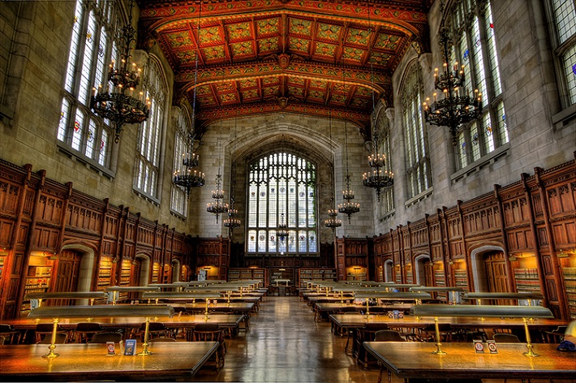
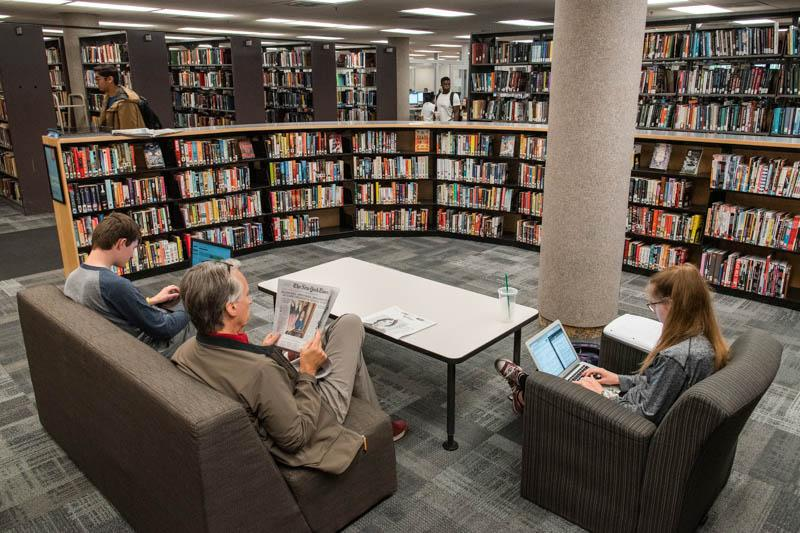
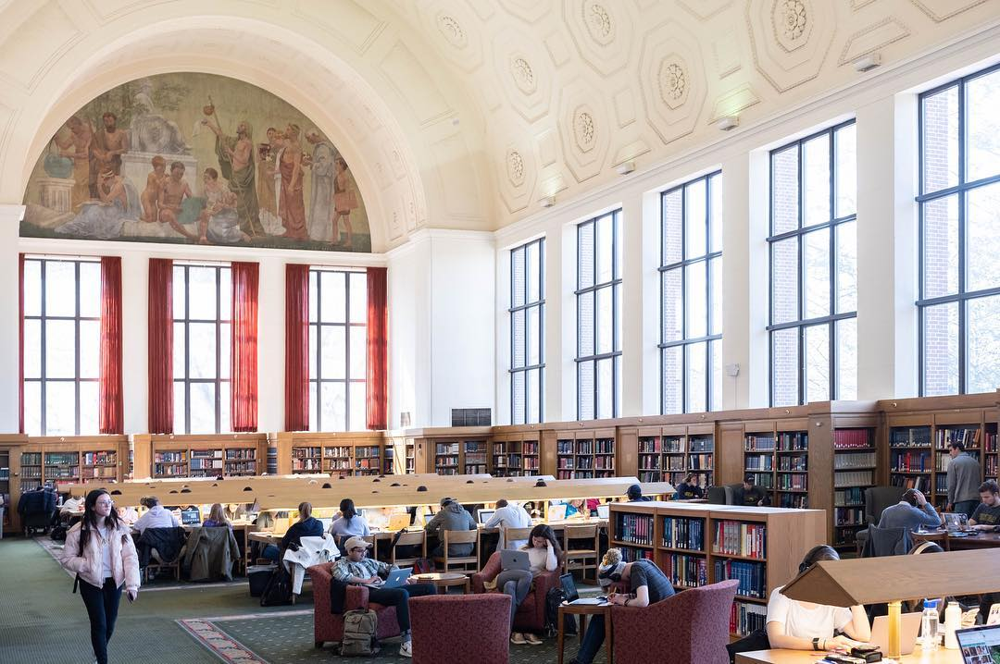
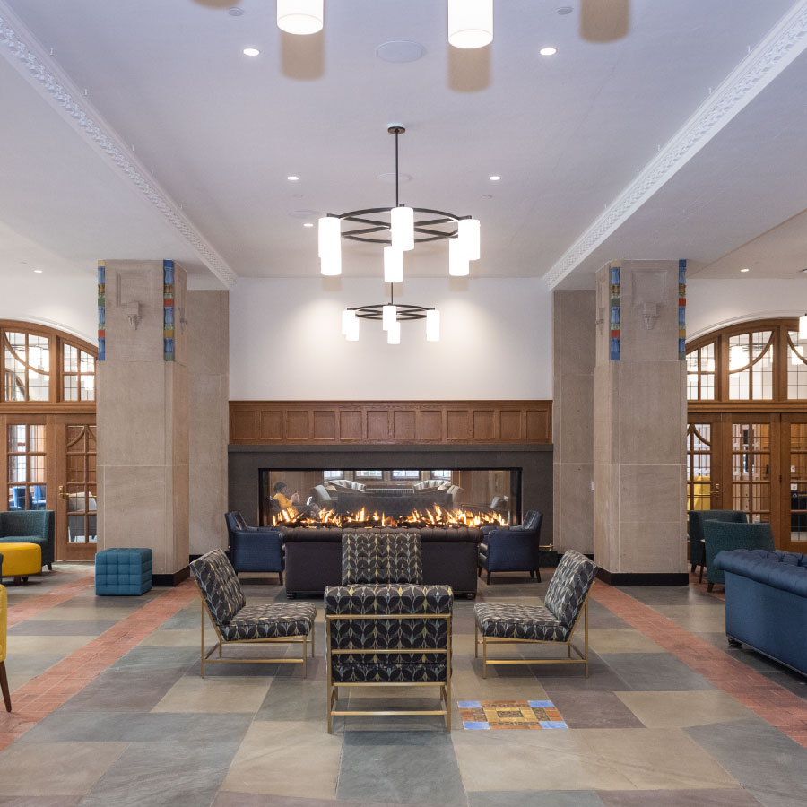
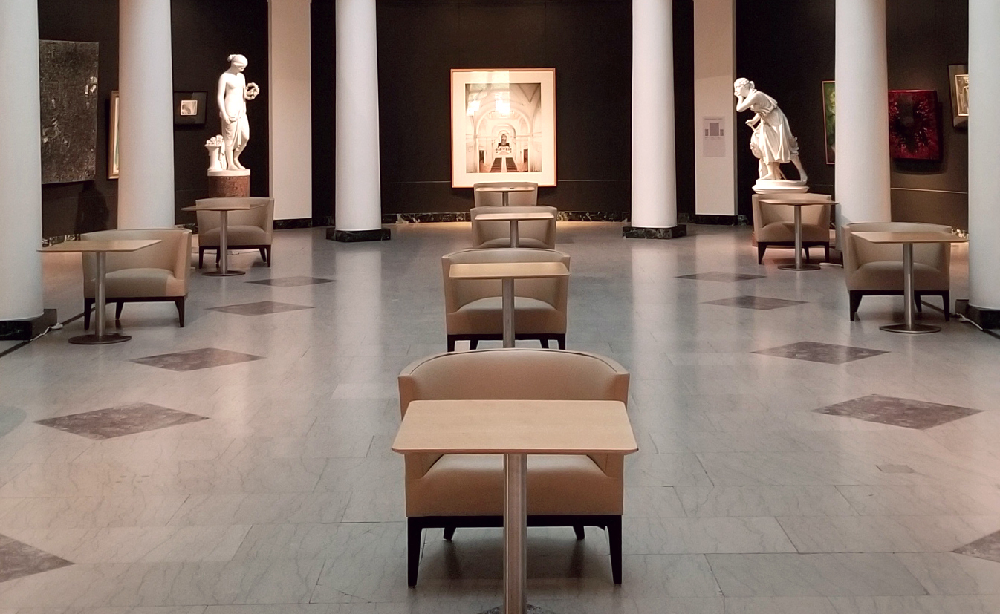
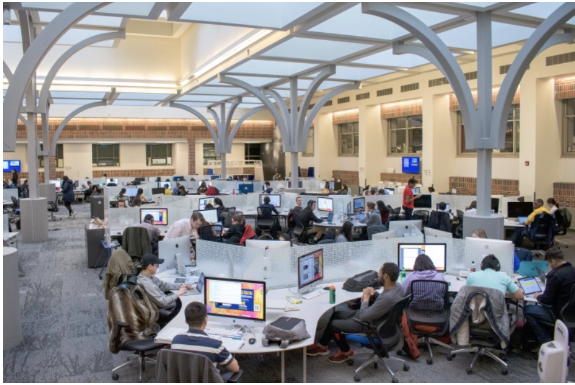

# Study Spots

<b>

University of Michigan is full of nice study spots where you can finish your assignments, work with your groups or prepare for your exams! Use this page to find just the right spot for you.

</b>

## In Ross Business School

<b>Ross</b> has beautiful interiors, lots of sky lights and glass windows that bring in natural light making studying in Ross a pleasurable experience. There is also a Starbucks in the building where you can get tasty drinks and food.\
Nosier areas-Winter garden, Lower Level open area, Blau Hall -- Lower Level Open area Quieter Areas-Private Study Rooms available in Ross, Blau, Kresge (Reserve these on iMpact -- make sure to check in, you get a strike if you don't)

## Around Ross 

<b>Law Library (2 mins -- right across the street)</b> If you're a harry potter fan you'll love this building. It's like being in Hogwarts. It has high ceilings, stain glass windows. They have a "no-talking" policy, so if you need a very quiet spot to study this is your go to.

  

<b>UGLi - Shapiro Undergrad Library (4 mins from Ross)</b>  Quiet Areas -- 4th Floor, large tables with privacy dividers. More Social Areas -- Basement, Floor 1, Floor 2. These floors have a variety of seating options-mobile tables and chairs, couches, whiteboards for brainstorming sessions, screens with HDMI connections and computer labs.

  

<b>Hatcher Graduate Library (4 mins away)</b> Quiet areas -- Floors 3, 4, 5 -- Along the perimeter of these floors you can find carrels. Small nooks with a desk, chair, window. You only need a reservation for carrels in Floor 3. Floor 6 -- This floor overlooks the Law Quad and Michigan Stadium. They have hard and soft seating (arm chairs).

  

<b>Michigan Union (5 mins away)</b>   There are a mix of quiet study lounges and louder open areas in all the five floors of the union. There are lots of restaurants in the building (Subway, Panda Express, Sweetwater) where you can get some fuel to keep you going.

  

<b>UMMA (5 mins away) </b>  If you like aesthetic working areas, there are 22 study spaces with leather chairs and power outlets in the first floor of UMMA (University of Michigan Museum of Art). There are always art related activities happening that you can take part in when you want a quick break.

  

<b>Fishbowl (In Angell Hall -- 5 mins away) </b>  This is a large computing center with more than 150 computers (MACs, Windows) and different types of printers. If you like working on a Desktop you'll really enjoy this workspace. Since it's a very popular space it can get crowded and loud.

  

<b>Weiser hall (8 mins away)</b>  The first floor has a lot of couches and tables where you can get comfortable and work in groups. The 8th and 9th floor are quieter areas with lots of study nooks. Weiser has Sit -to -Stand desks that allow you to adjust your workspace into a standing desk by pressing a button. The two story Community commons have a green wall with live plants that filter the air providing you with a healthier environment, the windows are quite big which fills these spaces with light.

  

<b>Michigan League (9 mins away)</b> There are lot of study areas around Maizie's Café, it can get pretty grounded. There are some very comfortable booths and chairs on the side by the windows. Lot of sunlight streams in making it a fun study spot. There are also some study tables in the basement.

