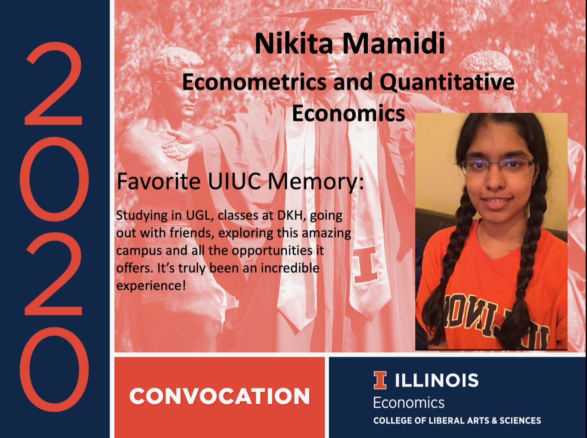
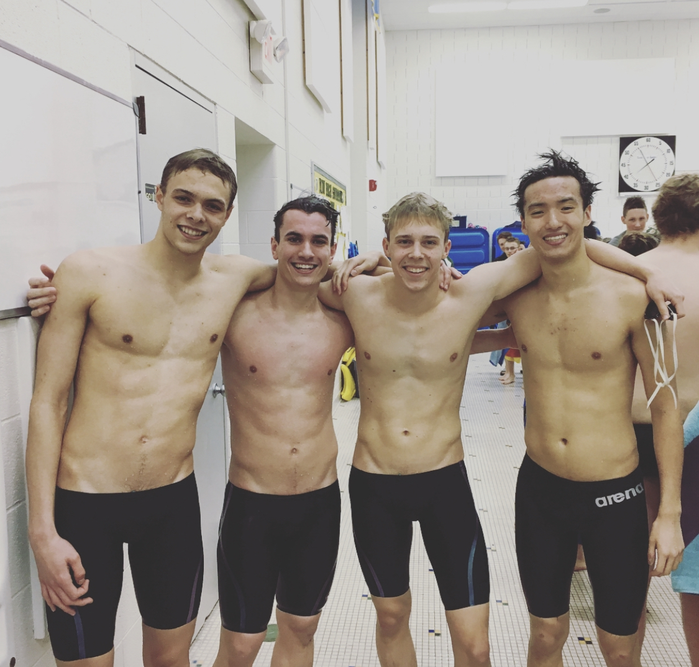
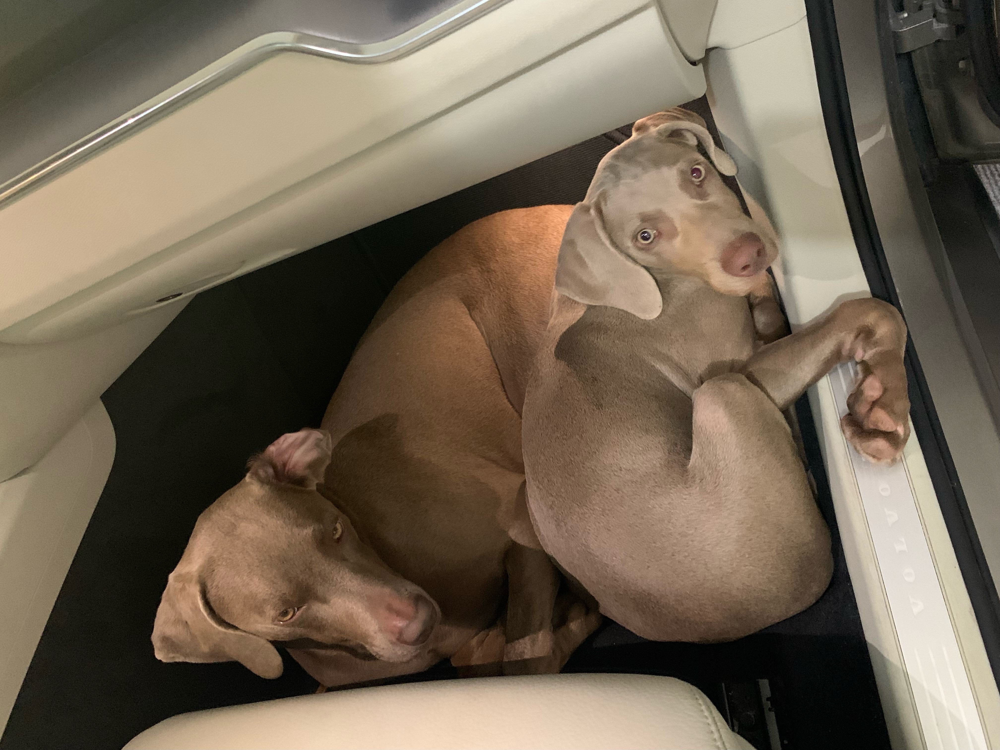
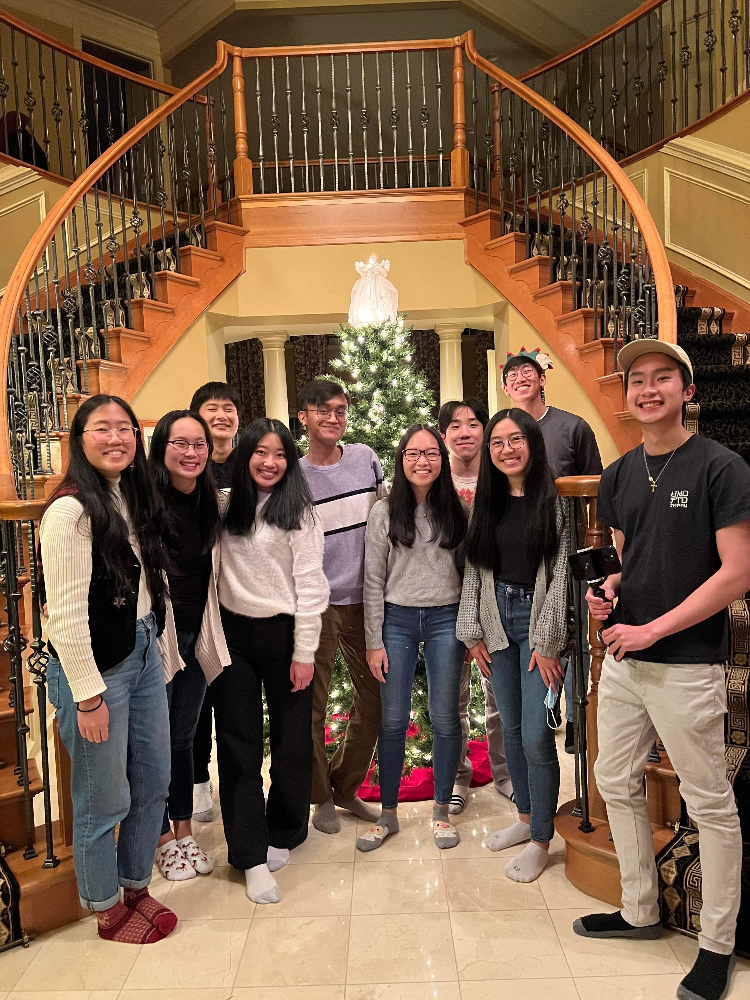
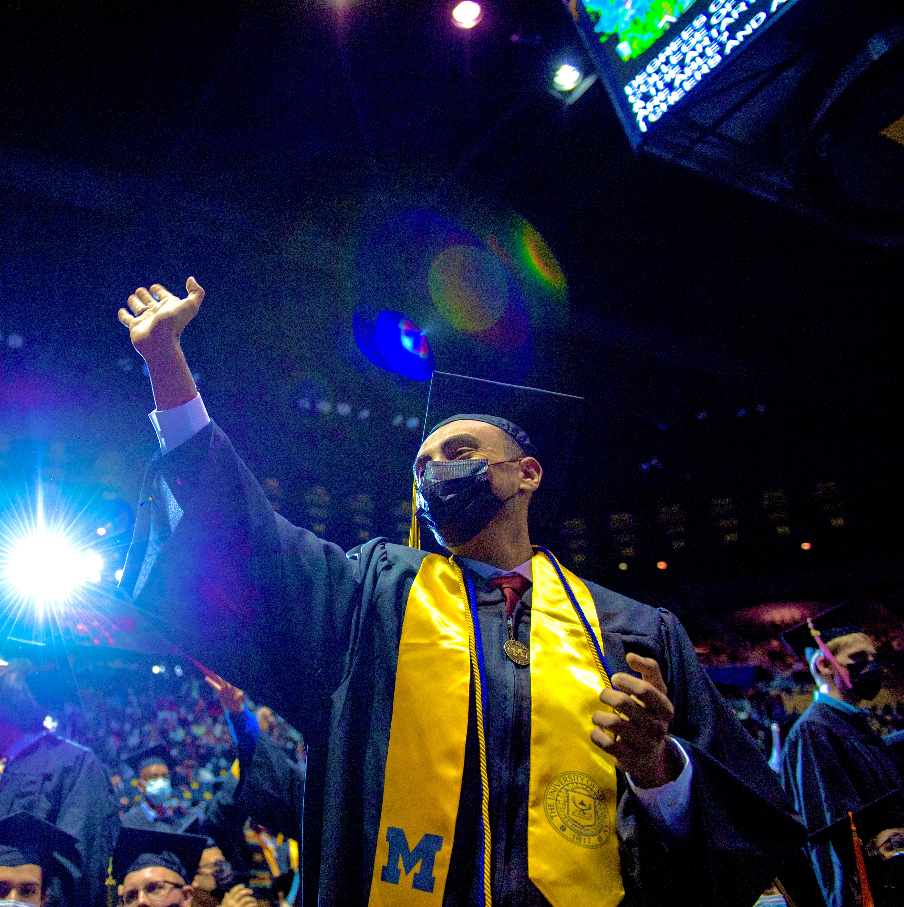

--- 
title: "HW3: Group Project GitHub + Bookdown Setup"
author: "Coded in COBOL"
date: "`r Sys.Date()`"
site: bookdown::bookdown_site
documentclass: book
bibliography: [book.bib, packages.bib]
# url: your book url like https://bookdown.org/yihui/bookdown
# cover-image: path to the social sharing image like images/cover.jpg
description: |
  This is our assignment for HW3.
link-citations: yes
github-repo: rstudio/bookdown-demo
---

# Table of Contents


**2. Introduction**

**3. About Us**

* 3.1 Yuchen
* 3.2 Nikita
* 3.3 Ben
* 3.4 Peiyue
* 3.5 Winnifer
* 3.6 Jalal

**4. Housing**

* 4.1 How to Find a Sublease
* 4.2 Sublease Mastersheet
* 4.3 Dorm Options
* 4.4 Luxury Apartments

**5. Product Development**

* 5.1 Our Group Process
* 5.2 Handling Challenges and Changes
* 5.3 Agile Work Practices
* 5.4 Managing Complexity
* 5.5 Plans Moving Forward

**6. Best Local Restaurants and Bars**
* 6.1 
* 6.2 
* 6.3 
* 6.4 
* 6.5 
* 6.6 

**7. Dining Options**
* 7.1 
* 7.2 
* 7.3 
* 7.4 
* 7.5 
* 7.6 

**8. Fun Things to do in Ann Arbor**
* 8.1 Outdoor Activities
* 8.2 Shopping
* 8.3 Downtown Ann Arbor
* 8.4 Places to Visit
* 8.5 Things to Do 
* 8.6 Athletic Events
* 8.7 Places to Visit Outside Ann Arbor

**9. Study Spots**
* 9.1 
* 9.2 
* 9.3 
* 9.4 
* 9.5 
* 9.6 

**10. Technology Tips**
* 10.1 
* 10.2 
* 10.3 
* 10.4 
* 10.5 
* 10.6 

**11. Transportation Tips**
* 11.1 
* 11.2 
* 11.3 
* 11.4 
* 11.5 
* 11.6 


<!--chapter:end:index.Rmd-->

# Introduction

We are Coded in Cobol. Our proposal is to create a detailed e-guide for newly admitted MBAn students. This guide can help students get familiar with the campus environment and make full use of the resources around them effectively. 

In class yesterday we talked with you about the fact that multiple groups are pursuing a similar idea. We plan to meet with these groups after submitting the proposal to split the tasks into three parts and then combine our three websites into one big website. Some specifics on the things we want to cover are:

## What We Plan to Cover
* Housing Options
* Best Local Restaurants and Bars
* Dining Options
* Fun Things to do in Ann Arbor
* Study Spots
* Technology Tips 
* Transportation Tips


<!--chapter:end:01-intro.Rmd-->

# About Us

In this section you can get to know more about the members of Coded in COBOL.

## Yuchen Gao

Hello! My name is Yuchen Gao. I'm currently a master student pursuing a [MBAn](https://michiganross.umich.edu/graduate/master-of-business-analytics) degree from the Ross School of Business at the University of Michigan. I have an undergraduate degree in Information Science from the [School of Information](https://www.si.umich.edu/) at the University of Michigan.

I am passionate about transforming data into impactful business solutions and would hope to work in the analytics field after getting my master's degree.

<center>

{width=50%}

</center>

**My favorite quote**
> “All models are wrong, but some are useful”       
>  George E.P. Box

**Interests and Hobbies**
- I spent the first 18 years of my life in Shanghai, but I also lived in Boston for two years before coming to Ann Arbor, MI.
- In my free time I like to play tennis. I'm currently trying to improve my backhand and serving.
- I'm a big fan of electronic music. My most favorite genres are techno house, future house, future bass.
- My favorite novel is Neuromancer by William Gibson. 
- I'm a coffee enthusiast. My favorite kind of coffee bean is Panama Geisha. If you happen to go to any coffee shop that is offering Geisha I highly recommend you to try it.

**More about Me...**
You can find more information about my professional experiences on [LinkedIn](https://www.linkedin.com/in/ycg2022/) and check out my past coding projects on [Github](https://github.com/Yuchen-G).


<style> 

h4 {
  color: #3D0C02;
  font-family: Avenir;
  background-color: #FDF5E6;
  }
  
body {
  color: #3D0C02;
  font-family: Avenir;
  background-color: #FDF5E6;
  }

</style>

## Nikita Mamidi

**I'm Nikita Mamidi 😃**

------------------------------------------------------------------------

<center>{width="900" height="450"}</center>

**A little bit about me:**

I graduated from the University of Illinois at Urbana Champaign with a BS in Econometrics and Quantitative Economics. I look back fondly on my undergrad days where I was an Ambassador for the amazing Economics department, the Head Teaching Assistant for a Business Statistics Course and a Senior Associate at Illinois Business Consulting. **GO ILLINI!**

In today's world organizations are coming up with so many fascinating data and tech driven solutions to previously insurmountable problems. I want to be part of such a force that impacts the world positively. To achieve those high-level data science skills, I recently started my Masters of Business Analytics at the Ross School of Business!

</style>

<center>{width="450" height="350"} {width="450" height="350"}</center>

------------------------------------------------------------------------

**Recent Work Experience:**

MSN Pharmaceuticals :- Sales and Marketing Executive

-   Responsible for the South Korean, Japanese, Indonesian, Thailand and Taiwanese markets
-   Determined potential partnerships in East Asia, established contacts & built relationships with key decision makers
-   Collaborated with technical teams to ensure production and distribution of high-quality samples and final API
-   Achieved the **\$3 million per month** revenue target for the past 2 quarters

------------------------------------------------------------------------

**Fun Facts:**
<center>{width="320" height="350"} {width="500" height="350"}</center>
<br>

-   I love to travel. Been to 20 countries. Next Destination - Mexico 🇲🇽
-   Stock market trading is everything! I'm a day trader tho, I know I'm awful 🤭
-   Certified online shopaholic. But I also return the goods with equal speed
-   I love watching (and dreaming of playing) in the NBA
-   I enjoy snorkeling and scuba diving
-   I'm terrified of all animals. Yes, including cute puppies and kittens 🤯


**That's enough about me 😁. Please reach out so I can learn more about You!**

<u> [Linkedin](https://www.linkedin.com/in/nikita-mamidi-763b80185/)</u>

<u> Contact - 217-898-6828 </u>

## Ben Newman
> Team: Coded in COBOL

Bio: Hi, I'm Ben. I was raised in Midland, MI. It's in the middle-right part of the mitten. In high school, I was on the swim team (see below) and did cross country. I also attended University of Michigan from which I graduated last year (see below). Some things that bring joy to my life are friends, family, my pets (see below), skiing, fishing, and going to Michigan Football Games!!

**My Education**

- Saint Brigid Catholic School (Midland, MI USA)
- Herbert Henry Dow High School (Midland, MI USA)
- University of Michigan Ann Arbor (Ann Arbor, MI USA)
    - B.S. Statistics
- University of Michigan Ann Arbor (Ann Arbor, MI USA)
    - Masters in Business Analytics

**My favorite foods.**

1. Pizza
2. Orange Chicken
3. Burgers


{width=25%}

> A picture of me (left) in my more fit days on the swim team (circa 2017).

{width=25%}

> A picture of my dogs Pearl (left) and Blue (right). They are Weimaraners.

{width=25%}

> This is me at the University of Michigan Commencement with my family in April, 2022.


## Peiyue Sun
This is Peiyue Sun.

- I love Michigan Wolverines!
- I love Wisconsin Badgers!

Education:

- Wisconsin School of Business 2016 -> 2019 Risk Management & Insurance (BBA)
- Ross School of Business 2022 -> 2023 Business Analytics (MBAn)

Technology used:

- R
- Python
- Excel

Work Experience:

- 2 years at Willis Towers Watson risk consulting sector
  * Insurance-linked securities valuation
  * Financial Reserving for global insurance enterprises
  
Goal at MBAN:

- Unlock my potential in business analytics and project management

Hobbies:

- Snooker, Basketball, Texas Hold'em, Swimming, Running, Biking, and Trap music festivals

{width=256}


## Winnifer Chen


Winnifer Chen

Email: winnifer@umich.edu

Phone: (980) 298-7184

LinkedIn: https://www.linkedin.com/in/winnifer/ 


**Educational Background**

I recently graduated with a Bachelor of Science in Economics with a minor in Statistics from the University of Michigan in April 2022. Currently, I am pursuing a Master of Business Analytics at the University of Michigan - Stephen M. Ross School of Business, with an expected graduation date of April 2023. 


{width=25%}
{width=40%}
{width=25%}


**Fun Facts!**

- I am from Ann Arbor, MI, but throughout my life, I have also lived in Charlotte, NC and Taipei, Taiwan.
- I come from a family of Wolverines! Both of my parents also attended graduate school at Michigan, and my younger sister is starting her freshman year this fall. GO BLUE!
- In my free time, I love to spend time outdoors, whether that is hiking, camping, or taking pictures of scenery. Check out some of the pictures I took: https://vsco.co/winniferchen/gallery
- I really enjoy rewatching music videos and performances by my favorite kpop groups. One of my dreams is to go to a kpop concert one day and sit in the very front section. 
- Immersing myself in the world of kdramas is another way for me to wind down and relax after a long day. 
- Something that I want to do more this year is trying new recipes and cooking more. 
 

{width=23%}
{width=25%}
{width=25%}
{width=25%}


## Jalal Mawri

Current Master of Business Analytics student at the Ross School of Business

{width=25%}
{width=25%}
{width=25%}

**Background**

I was born and raised in Yemen, the old city of Sana'a, and I left the country in 2013 with my family and immigrated to the United States. I grew up playing Football, a.k.a soccer, and my favorite team was and still is Manchester United.

**Education**

- I graduated from the University of Michigan with High Honors in Biology and International Studies.
- During my first two years as an undergraduate student I had the opportunity to work on a research project at the Medical School where we researched preventive medical treatments for strokes.
- During my senior year I wrote my thesis on the current civil war in Yemen, and I researched the Islamic Movement of Ansar Allah which is currently leading the political scene in Yemen and the Arabian Peninsula.

**Professional Experience**

- After graduating I interned for the Muslim Public Affairs Council, and worked on a project that persuaded the Biden Administration to enforce the reopening of Sana's Airport and push for a peace resolution between the parties involved in the war.
- After my internship, I started to work as a Data Analyst for Amazon.
- My plan after I graduate from Ross is to go back to Amazon and work as Business Intelligence Engineer.

**Publications**

Mawri, Jalal. “Ansar Allah in Yemen: History and Ideology.” Deep Blue Repositories, 1 Aug. 2021, https://deepblue.lib.umich.edu/handle/2027.42/169403.

Venugopal J, Wang J, Mawri J, Guo C, Eitzman D. Interleukin-1 receptor inhibition reduces stroke size in a murine model of sickle cell disease. Haematologica. 2021 Sep 1;106(9):2469-2477. doi: 10.3324/haematol.2020.252395. PMID: 32817286; PMCID: PMC8409048.

<!--chapter:end:02-about-us.Rmd-->

---
output:
  html_document: default
  pdf_document: default
---
# Housing

## Finding a sublease
<style>
title {
  color: #3D0C02;
  font-family: Comic Sans MS;
  }
  
body {
  color: #3D0C02;
  font-family: Verdana;
  }

</style>

<br>
**Facebook groups -**
You can use these groups to find subleases to your liking. The posts usually specify the number of beds/baths, amenities, prices, pictures and contact info. Make sure to reach out to the subleaser through messenger. You can always negotiate and reduce the price as it is a buyers market in Ann Arbor.

<br>
{width="300" height="250"} 
{width="300" height="250"}
{width="300" height="250"} 


- UMICH Housing, Rooms, Apartments, Sublets - (largest group with 33.4 K members)
https://www.facebook.com/groups/223351171575348/
- UMich Campus Housing (OFFICIAL)
<br>
https://www.facebook.com/groups/551056069413485/
- Ann Arbor Roommates and Housing
<br>
https://www.facebook.com/groups/267575123414633/

<br>
**Pro Tips** - Have a video call with the subleaser and see the apartment for yourself if you are unable to visit, read google reviews and talk to current students to get a better idea of the apartment(location, management, maintenance) 

<br>
**Calling Apartments: **
Another method that works would be to call the different apartments in areas you are interested in and ask them if any residents are interested in subleasing. They will connect you with subleasers or add you to their addressbook so they can reach out anytime any sublease becomes available. 

You could also ask for a lease transfer though this is a more expensive option as you need to pay the entire rent for the month. Lease transfers/takeovers are more useful if you want the lease for the entire academic year. 

<br>
**WeChat - **
UM信息平台
<br>
Wechat number: UMhome
<br>
You can use this user id from WeChat to find available sublets by accessing the moments page. 


## Lease Subletting Information

### Who this page is for:
- Current MBAn students wishing to sublet their current leases to future MBAn studets
- Prospective and admitted MBAn students wanting to find housing for the former or latter part of their experience

### You Want to Sublet Your Lease
So, you want to sublet your lease, but have had trouble finding someone. Great! We have taken the pain out of this process by connecting you with future MBAn students hungry to find a place to stay for a few months before their lease starts. To get started, just fill out this form. Interested students will be able to see all of this information and will contact you if they are interested. 

Form: https://docs.google.com/forms/d/e/1FAIpQLSfd5a1n3rtsh2xlqPA1M3tiaQFIl-nXuANBcQ9awZvN5U2sag/viewform

### You Need a Place to Stay
Your lease doesn't start until August, so you need a place to stay for the summer. Or, your lease ends early and you need a place to stay for those last few month of the MBAn program. No problem! In the Google Sheet below, you will find a list of current MBAn students wishing to sublet their lease. Plenty of information about the properties is included in this document, but if you need more info, don't hesitate to reach out--contact information is provided. Happy shopping!

Sheet: https://docs.google.com/spreadsheets/d/1nCS9Tw-RBSAceeZNXqH_YfsoTt1rkVl-x5Z3lqS9AoQ/edit?resourcekey#gid=536291696

## Dorms
**Graduate Residence Options for incoming MBAn students**

**Option 1**: Munger Graduate Residence

**Address**: 540 Thompson St, Ann Arbor, MI 48104

**Phone**: 734-764-0145

**E-mail**: fkamara@umich.edu

**Lease Term**: Munger contract terms end on either May 23 or July 23

**Price**: $1100/

**Features**: Close to campus, fully furnished and utilities included

**Description**: 
Located on Central Campus, the Munger Graduate Residences are designed specifically for graduate and professional level students from all U-M schools and colleges to actively engage in a transdisciplinary community. Transdisciplinary living brings a diverse mix of graduate and professional students from various fields together to live, study and build a culture of collaboration. You’ll join other graduate students in a furnished apartment with 6 or 7 single-occupancy bedroom suites, each with a private bathroom. The suites also include a very large kitchen, dining room and community space.

{width=256}

{width=256}

**Option 2**: NORTHWOOD I, II, IV & V APARTMENTS

**Address**:1000 McIntyre, Ann Arbor, MI 48105

**Phone**: 734-764-9998

**E-mail**: venegas@umich.edu

**Price**: Call for detail

**Features**: Utilities included with free parking lot

**Description**: 
There’s a lively and warm community at Northwood.  And because there is an active and kid-friendly social scene lead by our Residential Staff, it’s an ideal place for students with families. Our large Community Center has lounge areas, games, and hosts events all season long. Outside you’ll find playground areas, basketball and volleyball courts, and softball and soccer fields.

{width=256}

{width=256}

## High-rise Apartments

### Central Campus
#### Foundry Lofts

{width=32%}
{width=32%}
{width=31%} 
```{r, echo=FALSE, fig.align='center'}
knitr::include_graphics("Foundry map.PNG")
```

**Website:** https://www.foundryloftsannarbor.com/?utm_medium=market_site&utm_campaign=market_site&utm_source=liveumich

**Floor plans:**
Studio, 1-, 2-, 3-, & 4-Bedroom Apartments

**Description:**
If you’re looking for a lavish living experience with exclusive amenities, a premier location just minutes from campus, and the latest in interior apartment features, Foundry Lofts is right for you. Enjoy scenic views from the rooftop deck, stay productive in the work and study lounge, or satisfy late-night cravings at our ground-floor retail area. With fully furnished floor plans featuring private bedrooms and bath suites, expansive closets, stainless steel appliances, and so much more, Foundry Lofts offers everything one needs to live in style and comfort. With the needs of young professionals in mind, Foundry Lofts seamlessly weaves features to promote academics and socialization with a community that feels like home.

**Pros:**
Near Local Restaurants & Retail in Downtown

#### Saga Ann Arbor

{width=32%}
{width=32%}
{width=31%} 
```{r, echo=FALSE, fig.align='center'}

```

**Website:** 
https://www.sagaannarbor.com/

**Floor plans:**
1-, 2-, 3-, & 4-Bedroom Apartments

**Description:**
Saga Ann Arbor provides students with more than just a place to call home. The off campus housing near University of Michigan is centrally located in Ann Arbor, just minutes from the campus and many local favorites, including restaurants, shopping outlets, and recreation. But residents don’t have to go far for fun and relaxation, as our community boasts an array of resort-style amenities that help strike the perfect work-life balance. In addition, the apartments come fully furnished and boast modern interior features. For a UMich living experience unlike any other, look no further than Saga Ann Arbor.

**Pros:**
Nearby Retail & Shopping Destinations

### Apartments Near Ross

#### University Towers 

{width=32%} 
{width=32%} 
{width=25%} 
```{r, echo=FALSE, fig.align='center'} 
knitr::include_graphics("towers map.jpg") 
```

**Website:** 
https://u-towers.com/

**Floor plans:**
1-, 2-, 3-, & 4-Bedroom Apartments

**Description:**
Majestically overlooking downtown Ann Arbor, University Towers is the new standard for students in downtown apartment living. University Towers student housing features spacious and contemporary studio, one, two, and three bedroom floor plans with resort-class amenities and an award-winning leasing and maintenance staff. Residents can choose between two custom finish packages, and each apartment home is equipped with a fully renovated kitchen and bathroom, spacious bedrooms, and brand new windows with breathtaking views of the city.
Venturing outside of their off campus housing, residents indulge in various community amenities including the outdoor resort-style swimming pool, 24/7 state of the art fitness center, free Vertex coffee and tea bar, on-site restaurant, and convenience store.

**Pros:**
Over 30 restaurants and coffee shops are within 2 blocks from the apartment including East Quad dining.


#### Landmark

{width=32%}
{width=30%}
{width=35%}
```{r, echo=FALSE, fig.align='center'}
knitr::include_graphics("landmark_map.png")
```


**Website:** https://www.livethelandmark.com/ 

**Floor plans:** Studio, 2-, 3-, 4-, 5-, & 6-Bedroom Apartments

**Description:** Landmark is a high-rise luxury apartment located just in an 8-minute walk away from Ross. They offer a variety of floor plans from 1 to 6 bedrooms that come with 1 to 4 baths. In terms of pricing, the monthly rent ranges from $1250 to $2074. 


**Pros:** Washer and dryer in unit, fully furnished, and amenities include gym, pool, hot tub, study space, garage parking, theater


#### z place 

{width=36%}
{width=32%}
{width=30%}
```{r, echo=FALSE, fig.align='center'}

```


**Website:** https://www.zplaceapartments.com/


**Floor plans:** 2-, 4-, & 6-Bedroom Apartments


**Description:** Located just a 4 minute walk away from the Ross School of Business, Z Place Apartments offers luxury apartment units that will give you feel a sense of home, even when you are away from home. 


**Pros:** Washer and dryer in unit, fully furnished, and amenities include gym, underground parking


#### Six11

{width=33%}
{width=32%}
{width=33%}
```{r, echo=FALSE, fig.align='center'}

```


**Website:** https://www.livesix11.com/


**Floor plans:** Studio, 4-, 5-, & 6-Bedroom Apartments


**Description:** Looking for a luxury apartment just 5 minutes away from Ross? Six11 offers apartment units ranging from $1489 to $2359. 


**Pros:** Washer and dryer in unit, fully furnished, and amenities include rooftop terrace, gym, printers, study rooms, parking garage


### South Campus
#### Hoover and Greene

{width=32%}
{width=32%}
{width=32%}
```{r, echo=FALSE, fig.align='center'}
knitr::include_graphics("HG_map.png")
```


**Website:** https://hooverandgreene.com/


**Floor plans:** Studio, 1-, & 2-Bedroom Apartments


**Description:** Hoover and Greene is a luxury apartment complex located on the South side of campus, with close proximity to many of the athletic fields, and most importantly the Big House. Perfect location for any sports fans, as well as anyone studying at Ross. 


**Pros:** Washer and dryer in unit and amenities include gym, working space, courtyard terrace, pool


#### 618 South Main


{width=32%}
{width=32%}
{width=32%}
```{r, echo=FALSE, fig.align='center'}

```


**Website:** https://www.618southmain.com/


**Floor plans:** Studio, 1-, & 2-Bedroom Apartments


**Description:** 618 South Main is another housing option for anyone interested in living on South Campus near the athletic fields. In addition, this is one of the few high-rise, luxury apartments near campus that allows pets. 


**Pros:** Washer and dryer in unit, and amenities include gym, resident lounge, pool and hot tub, and underground parking. 2 pets are allowed but you do have to pay both a one-time fee and monthly rent. 


<!--chapter:end:03-finding-housing.Rmd-->

---
output:
  html_document: default
  pdf_document: default
---
# Product Development

## Our Group Process

*A documentation of your group process - how did you use the class material to make your group more effective.*

We utilized our Team Charter to set up rules and norms for the whole team which made our meetings more productive. We used GitHub regularly to improve our efficiency in finishing projects on time. 
The midpoint survey helped us highlight the areas that we need to improve on
Setting up meetings with at least a 24 hours note. 
Putting a title for each meeting so that everyone can prepare for the topic we’re meeting for.
One of the Agile principles that we’re trying to apply in our work is “simplicity.” 
Our goal is to design a website that is simple, yet provides new MBAn students with all the resources they need when arriving at Ross.  
We established a norm where all ideas are presented on a board and we vote on them making our team work more inclusive and democratic. 

## Handling Challenges and Changes

*How did your group handle challenges and change*

We are very supportive of each other as a team. We each had some trouble setting up GitHub initially. So the members who figured out how to push/pull were able to sort out any issues the other members had. 
We had the same website idea as some of the other teams, but instead of switching our topic, we approached the professor with our take on a Guide to Ann Arbor, and our plan to differentiate our site from the others with a particular focus on housing. Our passion for our project let us to convince him.
How did you divide work, leverage the unique strengths of each individual in the team
We broke the project into small pieces such as setting up GitHub pages, building books, etc. In terms of the book content, we also divided the sections of the book based on the strengths listed on our team charter. For example, Ben was experienced with google Forms and google sheet so he contributed to the sublease information form. Yuchen had previous experience with RStidio and GitHub so he was in charge of setting up GitHub and helping other members in the team with syncing with the remote repository. Other team members contributed to the project by setting up goals and timelines, and ensuring everyone in the team is working efficiently.  

## Agile Work Practices

*How did you adopt agile work practices*

We adopted several agile work practices in our group to keep the development process smooth and efficient. For one, we decided to name our gatherings according to the task to be done during that session. When unexpected challenges arose and forced us to change the scope of our project, we held a “Scope Change Document Write-up” session to document the changes to be made to our website, rather than a “weekly meeting.” When we arrived at the meeting, we were all prepared to dive into the task and did not have the feeling of dread accompanied by attending routine meetings. Second, we decided to eliminate minutes kept from our team charter. This allowed the meetings to flow much more organically and reduce the formality of the meetings. Finally, we decided to project work on one big screen in our meeting rooms to eliminate distractions and develop a central focus on the task.
 
## Managing Complexity

*How did you manage the RMarkdown/Git/GitHub complexity and learning curve*

Each of us made unique About Me websites, so everyone came in with different things they knew how to add in RMarkdown. This allowed us to show each other what we were capable of creating and allowed us to create a more visually-pleasing website using RMarkdown. As mentioned above, using Git and GitHub was difficult, especially with all the committing, pulling, and pushing we needed to do. After many tries, everyone on the team knows how to do it by themselves now so we can keep working on our website outside of team meetings, and this greatly increases our team productivity and efficiency. 
 
## Plans Moving Forward

*What more could you do to become a more effective and productive team in the time left*

One way to increase the effectiveness and efficiency of our team in the remaining days is to set clear objectives and goals for each meeting. This way, every member can come to each meeting with their completed parts and be ready for discussion and revision. At the end of each meeting, we should schedule subsequent meetings and make sure everyone understands what they need to have completed by the next meeting. 
Anything else you would like to provide that pertains to your group process and effectiveness.
Our group did well in setting up clear goals to achieve for each meeting. A typical Coded in Cobol meeting includes an agenda and a breakdown of bullet points for discussion. 
We often schedule work meetings 3 days ahead, giving each member plenty of time for preparation that leads to meaningful discussion.

<!--chapter:end:05-product-development.Rmd-->

---
output:
  html_document: default
  pdf_document: default
---
# Bars and Good

<!--chapter:end:06-BarsAndFood.Rmd-->


<!--chapter:end:07-dining.Rmd-->

# Fun Things to do in Ann Arbor

## Outdoor Activities
## Shopping
## Downtown Ann Arbor
## Places to Visit
## Things to Do 
## Athletic Events
## Places to Visit Outside Ann Arbor

<!--chapter:end:08-fun-things.Rmd-->

