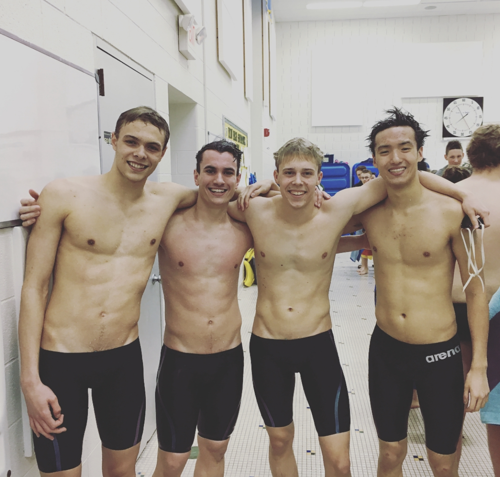
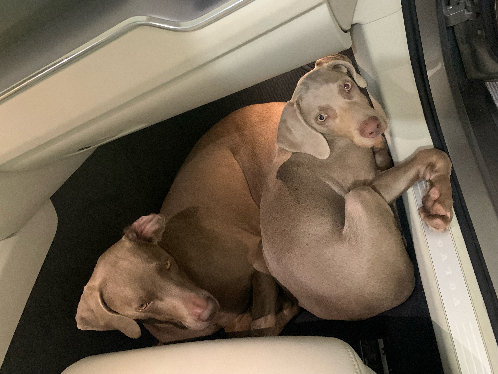
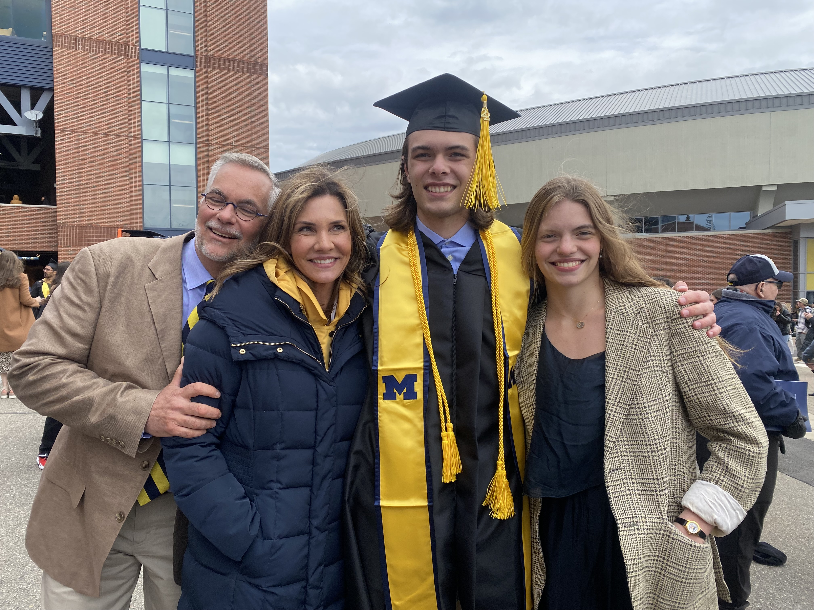

# About Us

## Yuchen Gao

Hello! My name is Yuchen Gao. I'm currently a master student pursuing a [MBAn](https://michiganross.umich.edu/graduate/master-of-business-analytics) degree from the Ross School of Business at the University of Michigan. I have an undergraduate degree in Information Science from the [School of Information](https://www.si.umich.edu/) at the University of Michigan.

I am passionate about transforming data into impactful business solutions and would hope to work in the analytics field after getting my master's degree.

{width=50%}

### My favorite quote
> “All models are wrong, but some are useful”       
>  George E.P. Box

### Interests and Hobbies
- I spent the first 18 years of my life in Shanghai, but I also lived in Boston for two years before coming to Ann Arbor, MI.
- In my free time I like to play tennis. I'm currently trying to improve my backhand and serving.
- I'm a big fan of electronic music. My most favorite genres are techno house, future house, future bass.
- My favorite novel is Neuromancer by William Gibson. 
- I'm a coffee enthusiast. My favorite kind of coffee bean is Panama Geisha. If you happen to go to any coffee shop that is offering Geisha I highly recommend you to try it.

### More about Me...
You can find more information about my professional experiences on [LinkedIn](https://www.linkedin.com/in/ycg2022/) and check out my past coding projects on [Github](https://github.com/Yuchen-G).

## Nikita Mamidi

### I'm Nikita Mamidi 😃

------------------------------------------------------------------------

{width="900" height="450"}

### **A little bit about me:**

I graduated from the University of Illinois at Urbana Champaign with a BS in Econometrics and Quantitative Economics. I look back fondly on my undergrad days where I was an Ambassador for the amazing Economics department, the Head Teaching Assistant for a Business Statistics Course and a Senior Associate at Illinois Business Consulting. **GO ILLINI!**

In today's world organizations are coming up with so many fascinating data and tech driven solutions to previously insurmountable problems. I want to be part of such a force that impacts the world positively. To achieve those high-level data science skills, I recently started my Masters of Business Analytics at the Ross School of Business!

</style>

{width="450" height="350"} {width="450" height="350"}

------------------------------------------------------------------------

### **Recent Work Experience:**

MSN Pharmaceuticals :- Sales and Marketing Executive

-   Responsible for the South Korean, Japanese, Indonesian, Thailand and Taiwanese markets
-   Determined potential partnerships in East Asia, established contacts & built relationships with key decision makers
-   Collaborated with technical teams to ensure production and distribution of high-quality samples and final API
-   Achieved the **\$3 million per month** revenue target for the past 2 quarters

------------------------------------------------------------------------

### **Fun Facts:**

{width="320" height="350"} {width="500" height="350"}

 

-   I love to travel. Been to 20 countries. Next Destination - Mexico 🇲🇽
-   Stock market trading is everything! I'm a day trader tho, I know I'm awful 🤭
-   Certified online shopaholic. But I also return the goods with equal speed
-   I love watching (and dreaming of playing) in the NBA
-   I enjoy snorkeling and scuba diving
-   I'm terrified of all animals. Yes, including cute puppies and kittens 🤯

***

### **That's enough about me 😁** 

#### Please reach out so I can learn more about You!

<u> [Linkedin](https://www.linkedin.com/in/nikita-mamidi-763b80185/)</u>

<u> Contact - 217-898-6828 </u>

## Ben Newman
> Team: Coded in COBOL

Bio: Hi, I'm Ben. I was raised in Midland, MI. It's in the middle-right part of the mitten. In high school, I was on the swim team (see below) and did cross country. I also attended University of Michigan from which I graduated last year (see below). Some things that bring joy to my life are friends, family, my pets (see below), skiing, fishing, and going to Michigan Football Games!!

My Education

- Saint Brigid Catholic School (Midland, MI USA)
- Herbert Henry Dow High School (Midland, MI USA)
- University of Michigan Ann Arbor (Ann Arbor, MI USA)
    - B.S. Statistics
- University of Michigan Ann Arbor (Ann Arbor, MI USA)
    - Masters in Business Analytics

My **favorite** foods.

1. Pizza
2. Orange Chicken
3. Burgers

{width=25%}

> A picture of me (left) in my more fit days on the swim team (circa 2017).

{width=25%}

> A picture of my dogs Pearl (left) and Blue (right). They are Weimaraners.

{width=25%}

> This is me at the University of Michigan Commencement with my family in April, 2022.

