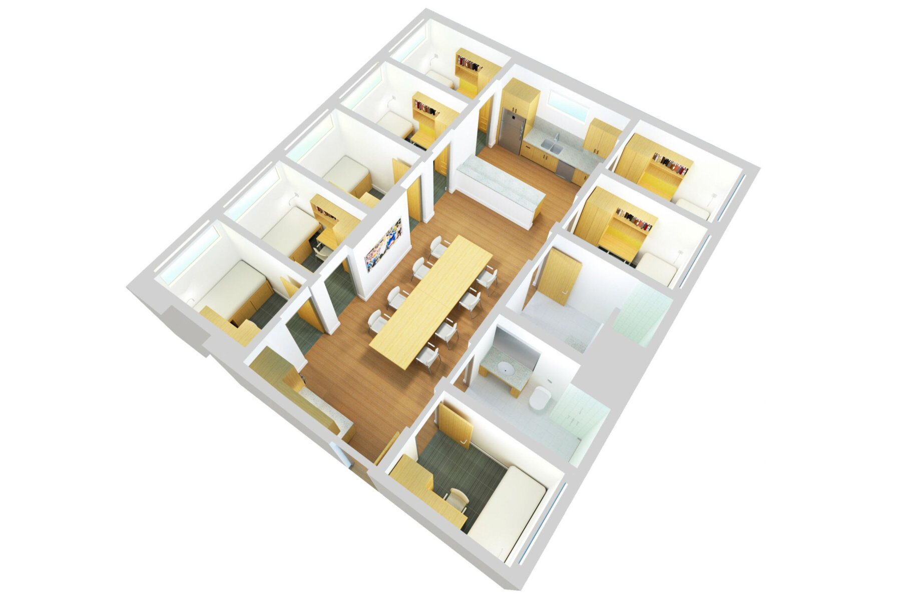

## Dorms
**Graduate Residence Options for incoming MBAn students**

**Option 1**: Munger Graduate Residence

**Address**: 540 Thompson St, Ann Arbor, MI 48104

**Phone**: 734-764-0145

**E-mail**: fkamara@umich.edu

**Lease Term**: Munger contract terms end on either May 23 or July 23

**Price**: $1100/

**Features**: Close to campus, fully furnished and utilities included

**Description**: 
Located on Central Campus, the Munger Graduate Residences are designed specifically for graduate and professional level students from all U-M schools and colleges to actively engage in a transdisciplinary community. Transdisciplinary living brings a diverse mix of graduate and professional students from various fields together to live, study and build a culture of collaboration. You’ll join other graduate students in a furnished apartment with 6 or 7 single-occupancy bedroom suites, each with a private bathroom. The suites also include a very large kitchen, dining room and community space.

{width=256}

{width=256}

**Option 2**: NORTHWOOD I, II, IV & V APARTMENTS

**Address**:1000 McIntyre, Ann Arbor, MI 48105

**Phone**: 734-764-9998

**E-mail**: venegas@umich.edu

**Price**: Call for detail

**Features**: Utilities included with free parking lot

**Description**: 
There’s a lively and warm community at Northwood.  And because there is an active and kid-friendly social scene lead by our Residential Staff, it’s an ideal place for students with families. Our large Community Center has lounge areas, games, and hosts events all season long. Outside you’ll find playground areas, basketball and volleyball courts, and softball and soccer fields.

{width=256}

{width=256}

