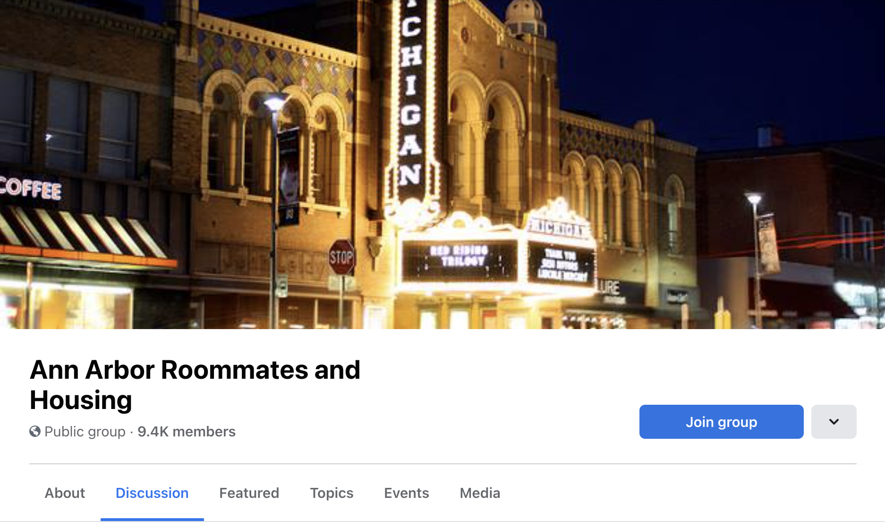

---
output:
  html_document: default
  pdf_document: default
---
## How To Find A Sublease
 

 
**Facebook groups -**
You can use these groups to find subleases to your liking. The posts usually specify the number of beds/baths, amenities, prices, pictures and contact info. Make sure to reach out to the subleaser through messenger. You can always negotiate and reduce the price as it is a buyers market in Ann Arbor.

 
{width=140, height=170} 
{width=140, height=170}
{width=140, height=170} 

- UMICH Housing, Rooms, Apartments, Sublets - (largest group with 33.4 K members)
https://www.facebook.com/groups/223351171575348/
- UMich Campus Housing (OFFICIAL)
 
https://www.facebook.com/groups/551056069413485/
- Ann Arbor Roommates and Housing
 
https://www.facebook.com/groups/267575123414633/

 
**Pro Tips** - Have a video call with the subleaser and see the apartment for yourself if you are unable to visit, read google reviews and talk to current students to get a better idea of the apartment(location, management, maintenance) 

 
**Calling Apartments: **
Another method that works would be to call the different apartments in areas you are interested in and ask them if any residents are interested in subleasing. They will connect you with subleasers or add you to their addressbook so they can reach out anytime any sublease becomes available. 

You could also ask for a lease transfer though this is a more expensive option as you need to pay the entire rent for the month. Lease transfers/takeovers are more useful if you want the lease for the entire academic year. 

 
**WeChat - **
UM信息平台
 
Wechat number: UMhome
 
You can use this user id from WeChat to find available sublets by accessing the moments page. 
